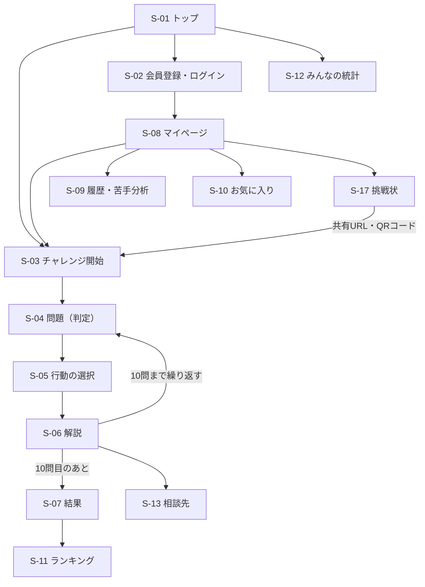
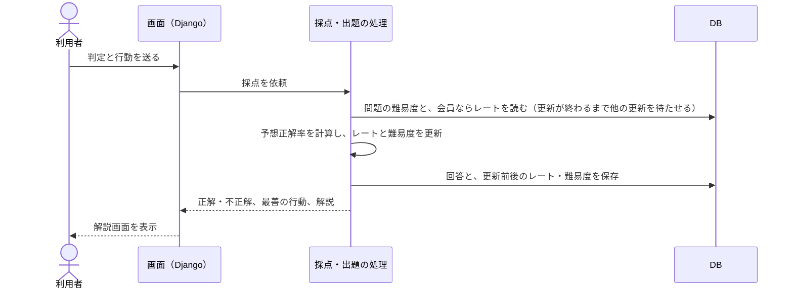
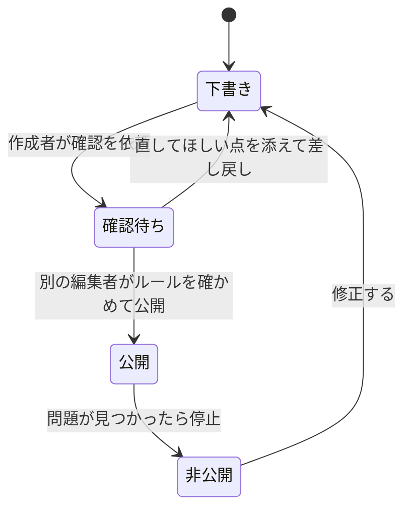
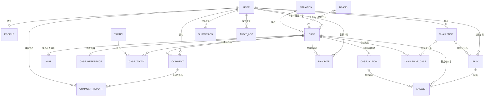

# 要件定義書：ネット詐欺見抜きトレーニング「ミヌケル」（仮称）

| 項目 | 内容 |
| --- | --- |
| 版 | 0.1（ドラフト。チームの確認待ち） |
| 作成日 | 2026年10月8日 |
| 作成 | Claude（Claude Code）。チームが確認・修正して確定する |
| 関連資料 | [概要説明](overview.md)、[チェックリスト](checklist.md)、[テーマ選定の調査（別紙2）](theme-research-more.md#31-ネット詐欺見抜きトレーニング仮称ミヌケル-89点) |

## 目次

0. [この文書について](#0-この文書について)
1. [概要](#1-概要)
2. [利用者](#2-利用者)
3. [範囲（スコープ）](#3-範囲スコープ)
4. [用語](#4-用語)
5. [問題（コンテンツ）の要件](#5-問題コンテンツの要件)
6. [機能要件](#6-機能要件)
7. [画面](#7-画面)
8. [主な処理の流れ](#8-主な処理の流れ)
9. [データ要件（DB設計）](#9-データ要件db設計)
10. [アルゴリズムの要件](#10-アルゴリズムの要件)
11. [非機能要件](#11-非機能要件)
12. [制約条件と技術構成](#12-制約条件と技術構成)
13. [外部とのやり取り](#13-外部とのやり取り)
14. [展示会の要件](#14-展示会の要件)
15. [評価の計画](#15-評価の計画)
16. [実装の順番（Issueの分け方）](#16-実装の順番issueの分け方)
17. [マイルストーン](#17-マイルストーン)
18. [未決事項](#18-未決事項チームで決めること)
19. [参考資料](#19-参考資料)

---

## 0. この文書について

- **目的**：何を作るのかを決め、チーム・担当教員・Claude が同じ認識で開発を進められるようにする。
- **使い道**：必須工程の「調査書と企画書」「仕様・概要図」の元にする。開発では、6章の機能要件1つ（または数個）を GitHub の Issue 1つにして、Claude に実装を依頼する（[16章](#16-実装の順番issueの分け方)）。
- **優先度の表し方**：

| 記号 | 意味 | 完成させる時期 |
| --- | --- | --- |
| 必須 | MVP（最小限の完成形）に入れる | 12月中旬（1/14の中間プレゼンで実際に動かす） |
| 追加 | MVPのあとに作る | 1月中（2/5に機能凍結） |
| 余裕 | 時間が余ったら作る | 2/5まで |
| 対象外 | 作らない | ― |

- **確定の手順**：[18章](#18-未決事項チームで決めること)の未決事項をチームで決め、10月のアンケート結果を反映して、10月末に v1.0 として確定する。確定後の変更は、変更点と理由をこの文書の末尾に書き足す。

---

## 1. 概要

### 1.1 背景

- フィッシングの報告件数は2024年に171万8,036件で過去最多になった。2026年7月の報告では、なりすまされたブランドが101件にのぼる。
- 特殊詐欺とSNS型投資・ロマンス詐欺の被害額は、2025年に合計3,257億円で過去最悪になった（警察庁の確定値）。警察官をかたる「ニセ警察詐欺」が急増し、SNS型投資詐欺の入口は広告が最も多い。
- 偽のセキュリティ警告で電話をかけさせる「サポート詐欺」の相談は、2026年4〜6月にIPAの相談窓口で1,428件あり、相談全体の37.3%を占めた。
- 差出人欄に実在するサービスのドメインを使ったものが、2026年7月に調査用アドレスに届いたフィッシングメールの約26.5%を占めた。送信元の認証を通る独自ドメインのフィッシングも増えている。**見た目だけでは見抜けない詐欺が増えている**ため、見抜くポイントを知るだけでなく、「迷ったらメッセージのリンクを使わず、公式アプリやブックマークから確かめる」行動を身につけることが大切になる。

### 1.2 目的

1. **手口を知り、見抜くポイントを身につける。**
2. **迷ったときの正しい行動を習慣にする**（リンクを開かない、公式から確かめる、相談する）。
3. **家族や周りの人と一緒に学ぶ**（挑戦状で同じ問題に挑戦してもらう）。

### 1.3 コンセプト

> 本物そっくりに作った架空のメール・SMS・SNSのメッセージ・Webサイトを見て、「本物か詐欺か」と「どう行動するか」を答える。1問ごとに見るべき場所を解説し、苦手な手口を分析して、同じ手口を繰り返し練習できる。

### 1.4 3階層

| 第1階層：ユーザー価値 | 第2階層：技術要素 | 第3階層：対象分野 |
| --- | --- | --- |
| **安全**（＋学べる・楽しい） | **データ分析・データの可視化**（＋WebAPI開発） | **地域社会**（＋学生生活） |

### 1.5 成功指標

| 指標 | 目標 | 測り方 |
| --- | --- | --- |
| 学習効果 | 同じ手口の問題の正答率が、1回目より2回目以降で15ポイント以上上がる | アプリの回答記録（[F-13](#f-13-統計分析)） |
| 安全な行動 | 「公式から確かめる」などの安全な行動を選ぶ割合が、1回目より上がる | アプリの回答記録 |
| 使いやすさ | SUS 68点以上（目標75点） | 完成後のアンケート |
| 展示会 | 2日間で100人以上が体験する | 展示会モードの記録 |

---

## 2. 利用者

### 2.1 ペルソナ

| | ペルソナ | 状況 | このサービスでしたいこと |
| --- | --- | --- | --- |
| A | 専門学校生・大学生（20歳） | SNS・フリマ・ネット通販を毎日使う。高額バイトや投資の誘い、マッチングアプリでの出会いに触れる機会が多い | 自分がだまされやすい手口を知りたい。友達と点数を競いたい |
| B | 会社員（30代） | ネットバンクと証券口座をスマホで使う。仕事のメールも多い | 短時間で最新の手口を確認したい |
| C | 親・祖父母（60代） | SMSや電話での詐欺が心配。スマホの操作に自信がない | 子どもから送られた挑戦状で、遊びながら学びたい。文字は大きい方がよい |
| D | 管理者（チームメンバー） | 問題を作り、投稿を審査する | 問題を安全に作って公開し、利用状況を確かめたい |

### 2.2 利用環境

- 主にスマホ（縦画面）。PCでも使える。
- 展示会ではタブレットと大画面のモニターを使う。

### 2.3 役割と権限

| 操作 | ゲスト（未ログイン） | 会員 | 編集者 | 管理者 |
| --- | --- | --- | --- | --- |
| 問題に挑戦する | ○ | ○ | ○ | ○ |
| 結果をニックネームで当日のランキングに載せる | ○ | ○ | ○ | ○ |
| 履歴・苦手分析・お気に入り | × | ○ | ○ | ○ |
| コメントを書く、通報する | × | ○ | ○ | ○ |
| 怪しいメッセージを投稿する | × | ○ | ○ | ○ |
| 挑戦状を作る | × | ○ | ○ | ○ |
| 挑戦状で挑戦する | ○ | ○ | ○ | ○ |
| 問題を作る・直す | × | × | ○ | ○ |
| 問題を確認して公開する（自分が作った問題は不可） | × | × | ○ | ○ |
| 投稿の審査、コメントの非表示 | × | × | ○ | ○ |
| 利用者・手口・展示会モードの管理 | × | × | × | ○ |

展示会のスタッフは管理者のアカウントで展示会モードを操作する。

---

## 3. 範囲（スコープ）

### 3.1 必須（MVP）

- アカウント（登録・ログイン・ログアウト・パスワード変更・退会）
- 10問チャレンジ（判定と行動の2段階で答える）と解説
- 6種類の画面の再現（メール・SMS・SNSのメッセージ・Webサイト・広告・会話）
- 人と問題のレーティング、難易度の表示、苦手な手口を多めに出す出題
- 履歴・苦手分析・お気に入り・マイページ
- ランキング、コメント
- 統計（手口別・画面の種類別・年代別のだまされた率、問題ごとの難しさ）
- 問題の作成・確認・公開の流れ（編集者向け）
- 相談先の案内、利用規約、プライバシーポリシー
- 初期の問題40問（[問題集](question-bank/README.md)の問題案から選んで仕上げる）

### 3.2 追加

- 展示会モード（大画面のダッシュボード、短縮版チャレンジ）
- 挑戦状
- 怪しいメッセージの投稿と審査
- URLの読み方トレーニング
- リンクを押してしまったときの注意表示
- 文字を大きくする切り替え
- 問題を80問に増やす

### 3.3 余裕があれば

- 手口図鑑（手口ごとの解説ページ）
- 見るべき場所を画面上でタップして答える問題
- 学習の連続日数の表示、バッジ
- 主催者向けのCSV出力

### 3.4 対象外（作らない）

| 内容 | 理由 |
| --- | --- |
| 実際に届いたメッセージや実在のURLが安全かどうかの判定 | 判定を誤ると利用者に実害が出る。外部のサービスも必要になる |
| 生成AIによる問題作成 | 内容の正確さを保証しにくい。今回は人が作って確認する |
| 電話の音声の再現 | 文章（会話形式）で再現する |
| メールの送信（パスワード再設定メールなど） | 外部のメールサービスが必要になる。パスワードを忘れたら管理者が再設定する |
| スマホのネイティブアプリ、多言語対応 | Webのレスポンシブ表示で対応する |

---

## 4. 用語

| 用語 | 意味 |
| --- | --- |
| 問題 | 1つの架空のメッセージや画面と、その正解・解説のセット |
| 画面の種類 | メール、SMS、SNSのメッセージ、Webサイト、広告、会話（SNSや電話でのやり取りをチャット風に再現したもの） |
| 判定 | 「本物」か「詐欺」かを答えること |
| 行動 | 「このあとどうするか」を選ぶこと。安全な行動を「最善の行動」とする |
| 手口 | 詐欺のやり方の分類（例：急がせる、そっくりドメイン）。問題には1つ以上の手口のタグを付ける |
| 見るべき場所 | 解説で強調する箇所（送信元、URL、文言など） |
| レート | 利用者の見抜く力を表す数値 |
| 難易度 | 問題の難しさを表す数値。回答が集まるほど正確になる |
| 挑戦 | 10問（展示会では5問）のひとまとまり |
| 挑戦状 | 会員が固定した問題セットと、それに挑戦するためのURL・QRコード |
| 架空ブランド | 問題用に作った、実在しない会社・サービス |
| 登録ドメイン | URLのうち、その持ち主を表す部分（例：`login.mirai-bank.example` の `mirai-bank.example`） |

---

## 5. 問題（コンテンツ）の要件

このサービスの価値は問題の質で決まる。問題は人（チーム）が作り、別の人が確認してから公開する。

### 5.1 画面の種類

| 種類 | 再現する画面 | 主な手口の例 |
| --- | --- | --- |
| メール | 受信画面（差出人名・アドレス・件名・本文・リンク・ボタン） | カード会社・通販・証券会社のなりすまし |
| SMS | スマホのメッセージ画面（送信元の番号や名前・本文・リンク） | 宅配の不在通知、料金の未払い |
| SNSのメッセージ | SNSのダイレクトメッセージ画面 | 投資グループへの勧誘、高額バイトの勧誘 |
| Webサイト | ブラウザ画面（アドレスバー・ページ本体・入力欄） | 偽のログイン画面、偽の通販サイト、偽のセキュリティ警告 |
| 広告 | SNSや検索結果に出る広告 | 著名人を装った投資広告、極端な値引き |
| 会話 | チャット風のやり取り（電話やビデオ通話の内容を文字で再現） | ニセ警察詐欺、ロマンス詐欺 |

### 5.2 問題の形式

1. **判定**：「本物」「詐欺」の2択。
2. **行動**：「このメッセージを受け取ったら、どうする？」の3〜4択。例：
   - リンクを開いて、案内どおりに手続きする
   - 書かれている電話番号に電話して確かめる
   - メッセージのリンクは使わず、公式アプリやブックマークから確かめる
   - 家族や相談窓口に相談する

   **本物の問題でも、最善の行動は「公式アプリやブックマークから確かめる」になる場合がある。** 見た目だけでは見分けられない詐欺が増えているため、「どんなメッセージでも、大事な手続きは公式から」を習慣にしてもらう。

3. **見るべき場所**（余裕）：画面の中の怪しい箇所をタップする。
4. **URLの読み方**（追加）：URLの中の「登録ドメイン」をタップする。

### 5.3 手口の分類（タグ）

| コード | 手口 | 内容 |
| --- | --- | --- |
| T01 | なりすまし | 企業・サービス・公的機関の名前をかたる |
| T02 | そっくりドメイン | つづり違い、紛らわしい文字（l と 1 など）、別の文字体系の文字を使う |
| T03 | URLの見せかけ | 短縮URL、正規の名前をサブドメインに入れる、表示と飛び先が違う |
| T04 | 急がせる・不安をあおる | 「アカウント停止」「本日中に」「逮捕状が出ている」 |
| T05 | 利益で釣る | 当選、高額報酬、「必ずもうかる」 |
| T06 | 情報を入力させる | ID・パスワード、カード番号、ワンタイムパスワード |
| T07 | お金を払わせる | 電子マネーのカード番号を伝えさせる、暗号資産、個人名義の口座への振込 |
| T08 | 電話をかけさせる | 偽の警告画面に出るサポートの番号、「至急連絡を」 |
| T09 | 不在通知 | 宅配業者をかたる再配達の案内 |
| T10 | 偽のセキュリティ警告 | 警告音・全画面表示で慌てさせるサポート詐欺 |
| T11 | 投資・副業の勧誘 | SNS広告、著名人の名前、投資グループへの招待 |
| T12 | 親しくなってから | 恋愛感情や信頼関係を作ってから、投資やお金の話をする |
| T13 | 警察・公的機関をかたる | ニセ警察詐欺、税金・公共料金の未納 |
| T14 | 闇バイトの勧誘 | 「高額・即日」「荷物を受け取るだけ」 |
| T15 | 偽の通販サイト | 極端な値引き、不自然な日本語、個人名義の振込先 |

本物の問題には手口のタグを付けず、「本物と確かめる方法」を解説に書く。

### 5.4 問題数と配分

| 項目 | MVP | 最終 |
| --- | --- | --- |
| 問題数 | 40問 | 80問 |
| 詐欺と本物の割合 | およそ6：4（「全部詐欺と答えれば正解」にならないように） | 同じ |
| 画面の種類 | 各種類5問以上 | 各種類10問以上 |
| 手口 | 各手口2問以上 | 各手口4問以上 |
| 初期の難易度 | やさしい・ふつう・むずかしいを作成者が設定（回答が集まると自動で更新される） | 同じ |

### 5.5 作成のルール（必ず守る）

| ID | ルール |
| --- | --- |
| C-01 | **実在の企業名・サービス名・ロゴ・人名を使わない。** 架空ブランドを作って使う（例：ミライ銀行、ネコマ運輸、ポチッと通販）。架空ブランドの名前は、実在しないことをWeb検索で確かめる |
| C-02 | **URLは予約済みのドメインを使う。** 例示用に予約されている `.example` や `.test` を基本とする（例：`mirai-bank.example`）。問題の中のURLはリンクにせず、押しても外部のサイトに移動しない |
| C-03 | **電話番号は一部を伏せる。** 例：`010-XXXX-XXXX` |
| C-04 | **実際の詐欺メッセージの画面写真をそのまま使わない。** 公的機関の注意喚起などを参考に、自分たちで書き直す |
| C-05 | **だます側のやり方は書かない。** 見抜き方と正しい行動に絞る |
| C-06 | **解説には必ず4つを書く**：見るべき場所、なぜ怪しいのか（本物ならなぜ本物と言えるのか）、正しい行動、参考資料（公的機関の注意喚起など） |
| C-07 | **作った人とは別の人が確認してから公開する**（[8.2節](#82-問題の作成から公開まで)） |
| C-08 | 必要以上に怖がらせる表現や、特定の人を傷つける表現を使わない |

### 5.6 問題のデータ項目

画面はHTMLとして保存せず、項目ごとに保存して、画面の種類ごとのテンプレートで組み立てる（XSS対策）。

| 項目 | 必須 | 内容 |
| --- | --- | --- |
| 管理用の名前 | ○ | 一覧で見分けるための短い名前 |
| 画面の種類 | ○ | メール・SMS・SNS・Webサイト・広告・会話 |
| シチュエーション | ○ | 場面の分類（S01〜S18。[問題集](question-bank/README.md)を参照） |
| 状況の説明 | | 問題の前提（例：自分でログインした直後、荷物を待っている）。問題の前に表示する |
| 架空ブランド | | どのブランドをかたるか（またはどのブランドからの本物か） |
| 正解 | ○ | 本物 または 詐欺 |
| 送信元の表示名・アドレス（番号） | | メール・SMS・SNSで使う |
| 件名 | | メールで使う |
| 本文 | ○ | 文字のみ。改行と、強調したい語句の印だけを使える |
| リンクの文字・URL | | 表示するだけ。リンクにはしない |
| アドレスバーのURL | | Webサイトで使う |
| 画面の部品 | | ボタン・入力欄・警告文など（種類ごとの決まった形式） |
| 会話の発言 | | 会話で使う（話し手と発言の並び） |
| 行動の選択肢と最善の行動 | ○ | 3〜4個。最善は1つ |
| 手口のタグ | 詐欺なら○ | T01〜T15から1つ以上 |
| 見るべき場所 | ○ | 対象の部分（送信元・URLなど）と説明。1つ以上 |
| 解説 | ○ | なぜ怪しいか（本物と言えるか）、正しい行動 |
| 参考資料 | ○ | 公的機関などの資料名とURL。1つ以上 |
| 初期の難易度 | ○ | やさしい・ふつう・むずかしい |
| 状態 | ○ | 下書き・確認待ち・公開・非公開 |
| 作成者・確認者 | ○ | 確認者は作成者と別の人 |

---

## 6. 機能要件

各機能の「確認方法」は、完成したかどうかを判断する条件（受け入れ条件）。自動テストか、手での操作で確かめる。

### F-01 アカウント

| ID | 優先度 | 要件 | 確認方法 |
| --- | --- | --- | --- |
| F-01-1 | 必須 | ユーザー名・パスワード・ニックネームで会員登録できる。メールアドレスと氏名は集めない | 登録後にログイン状態になる。同じユーザー名では登録できない |
| F-01-2 | 必須 | ログイン・ログアウトできる | 誤ったパスワードではログインできず、「ユーザー名またはパスワードが違います」と表示される |
| F-01-3 | 必須 | パスワードを変更できる | 変更後は新しいパスワードでだけログインできる |
| F-01-4 | 必須 | 年代を任意で登録できる（10代以下〜70代以上） | 未登録でもすべての機能を使える |
| F-01-5 | 必須 | 退会できる | 退会するとアカウントが削除され、回答の記録は個人と結び付かない形で統計用に残る |
| F-01-6 | 必須 | ログインに続けて失敗すると、一定時間ログインできなくなる | 5回失敗すると15分間ログインできない |

### F-02 チャレンジ（10問）

| ID | 優先度 | 要件 | 確認方法 |
| --- | --- | --- | --- |
| F-02-1 | 必須 | ゲストでも会員でも、10問のチャレンジを始められる | トップ画面から2タップ以内で1問目が表示される |
| F-02-2 | 必須 | 1問ごとに「判定 → 行動 → 解説」の順に進む | 判定を選ぶまで行動の選択肢は出ない。解説を見てから次の問題に進む |
| F-02-3 | 必須 | 1回のチャレンジで同じ問題は出ない。詐欺と本物はおよそ6：4 | 自動テストで、出題の重複がなく、割合が範囲内であることを確かめる |
| F-02-4 | 必須 | 10問が終わると結果画面を表示する | 判定の正答数、安全な行動を選んだ数、手口ごとの結果、会員ならレートの変化を表示する |
| F-02-5 | 必須 | 結果をニックネームで当日のランキングに載せるかどうかを選べる | 載せないを選ぶとランキングに表示されない |
| F-02-6 | 追加 | 問題の中のリンクやボタンを押すと、「本物の詐欺なら、偽のサイトに移動していました」と注意を表示する | 外部のサイトには移動しない。押したことが記録される |
| F-02-7 | 余裕 | 途中でやめても、同じ端末なら続きから再開できる | 再開すると、答えた問題の次から始まる |

### F-03 問題画面の再現

| ID | 優先度 | 要件 | 確認方法 |
| --- | --- | --- | --- |
| F-03-1 | 必須 | 6種類の画面を、それぞれ本物らしいレイアウトで表示する | 種類ごとのテンプレートで、5.6節の項目が表示される |
| F-03-2 | 必須 | 問題の中のURLはリンクにしない | HTMLに外部のサイトへのリンクが出力されないことを自動テストで確かめる |
| F-03-3 | 必須 | スマホの縦画面で、横にスクロールせずに読める | 幅360pxの画面で横スクロールが出ない |

### F-04 解説

| ID | 優先度 | 要件 | 確認方法 |
| --- | --- | --- | --- |
| F-04-1 | 必須 | 正解・不正解と、最善の行動を表示する | 色だけでなく、アイコンと文字でも分かる |
| F-04-2 | 必須 | 見るべき場所を画面の上で強調し、説明を表示する | 問題に登録したすべての見るべき場所が強調される |
| F-04-3 | 必須 | なぜ怪しいか（本物と言えるか）、正しい行動、参考資料を表示する | 参考資料は新しいタブで開く公的機関などのページ |
| F-04-4 | 必須 | 解説の下に、相談先の案内へのリンクを表示する | 相談先のページ（[F-15](#f-15-案内ページ)）に移動できる |

### F-05 レーティングと出題

| ID | 優先度 | 要件 | 確認方法 |
| --- | --- | --- | --- |
| F-05-1 | 必須 | 回答のたびに、会員のレートと問題の難易度を更新する（[10.1節](#101-レーティング)） | 計算例どおりの値になることを自動テストで確かめる |
| F-05-2 | 必須 | 問題の難易度を★1〜5で表示する | 難易度の値と★の対応が10.1節のとおりになる |
| F-05-3 | 必須 | 会員には、正解できそうな確率がちょうどよい問題と、苦手な手口の問題を多めに出す（[10.2節](#102-出題の選び方)） | 苦手な手口が分かっている会員（回答が3件以上ある手口がある会員）で、苦手な手口の問題が10問中3問以上入ることを自動テストで確かめる |
| F-05-4 | 必須 | ゲストには、難易度を混ぜて出す | ★1〜2が4問、★3が4問、★4〜5が2問（足りない場合は近い難易度で補う） |
| F-05-5 | 必須 | 同時に回答しても、レートが壊れない | 同じ問題への同時回答を再現した自動テストで、更新が失われないことを確かめる |

### F-06 履歴・苦手分析（保存）

| ID | 優先度 | 要件 | 確認方法 |
| --- | --- | --- | --- |
| F-06-1 | 必須 | 会員は、過去のチャレンジの一覧と結果を見られる | 新しい順に表示される |
| F-06-2 | 必須 | 手口ごとの正答率と、苦手な手口の上位3つを表示する | 回答が3件未満の手口は「データ不足」と表示する |
| F-06-3 | 必須 | 間違えた問題をもう一度見られる（解説付き） | 一覧から問題と解説を開ける |
| F-06-4 | 必須 | レートの推移をグラフで表示する | 回答のたびの値が折れ線で表示される |

### F-07 お気に入り（保存）

| ID | 優先度 | 要件 | 確認方法 |
| --- | --- | --- | --- |
| F-07-1 | 必須 | 解説画面から、問題をお気に入りに登録・解除できる | 同じ問題を二重に登録できない |
| F-07-2 | 必須 | マイページでお気に入りの一覧を見られる | 一覧から問題と解説を開ける |

### F-08 マイページ（保存）

| ID | 優先度 | 要件 | 確認方法 |
| --- | --- | --- | --- |
| F-08-1 | 必須 | 現在のレート、挑戦回数、苦手な手口、最近の結果をまとめて表示する | ログインしていないと開けない |

### F-09 ランキング（共有）

| ID | 優先度 | 要件 | 確認方法 |
| --- | --- | --- | --- |
| F-09-1 | 必須 | 会員のレートのランキングを表示する（全期間と週間） | 回答が10問未満の会員は載せない |
| F-09-2 | 必須 | 当日のチャレンジの得点ランキングを表示する（ゲストを含む） | 載せることを選んだ人だけが載る |
| F-09-3 | 必須 | ランキングにはニックネームだけを表示する | ユーザー名は表示されない |
| F-09-4 | 必須 | 不適切なニックネームを登録できない | 禁止語を含むニックネームは登録時に断られる |

### F-10 コメント（共有）

| ID | 優先度 | 要件 | 確認方法 |
| --- | --- | --- | --- |
| F-10-1 | 必須 | 会員は、解説画面で問題にコメントを書ける（例：「似たメッセージが実際に来た」） | 500文字まで。空欄では投稿できない |
| F-10-2 | 必須 | 禁止語を含むコメントは投稿できない | 禁止語の一覧はDBで管理する |
| F-10-3 | 必須 | 会員は不適切なコメントを通報でき、編集者は非表示にできる | 同じ人は同じコメントを二重に通報できない |
| F-10-4 | 必須 | コメントの中のURLはリンクにせず、無害化して表示する | `https://` が `hxxps://`、`.` が `[.]` で表示される |
| F-10-5 | 追加 | 1人が1日に書けるコメントの数を制限する | 1日20件を超えると投稿できない |

### F-11 怪しいメッセージの投稿（共有）

| ID | 優先度 | 要件 | 確認方法 |
| --- | --- | --- | --- |
| F-11-1 | 追加 | 会員は、受け取った怪しいメッセージを文字で投稿できる | 画像は受け付けない（文字のみ） |
| F-11-2 | 追加 | 投稿画面に「自分の名前・電話番号・住所などは消してください」と表示する | 電話番号やメールアドレスらしい文字列は、保存時に自動で伏せ字にする |
| F-11-3 | 追加 | 投稿はそのまま公開せず、編集者が審査する | 状態は「受付・採用・見送り」。採用した投稿は、作成のルール（5.5節）に沿って書き直して問題にする |

### F-12 挑戦状（共有）

| ID | 優先度 | 要件 | 確認方法 |
| --- | --- | --- | --- |
| F-12-1 | 追加 | 会員は、10問を固定した挑戦状を作り、共有用のURLとQRコードを発行できる | 有効期限（初期値30日）が過ぎると挑戦できない |
| F-12-2 | 追加 | 挑戦状を受け取った人は、ゲストのままで同じ10問に挑戦できる | 出題の順番は全員同じ |
| F-12-3 | 追加 | 作った人は、挑戦した人の結果の一覧（ニックネームと得点）を見られる | 作った本人以外は一覧を見られない |

### F-13 統計（分析）

| ID | 優先度 | 要件 | 確認方法 |
| --- | --- | --- | --- |
| F-13-1 | 必須 | 手口ごと・画面の種類ごとの「だまされた率」をグラフで表示する | 公開中の問題への回答だけを集計する |
| F-13-2 | 必須 | 年代ごとの正答率を表示する | 回答者が5人未満の年代は表示しない |
| F-13-3 | 必須 | 問題ごとの正答率・難易度・回答数の一覧（編集者向け） | 並び替えができる |
| F-13-4 | 必須 | 日ごとの挑戦数を表示する | 直近30日の折れ線グラフ |
| F-13-5 | 必須 | 学習効果を表示する：同じ手口について、1回目と2回目以降の正答率を比べる | 会員の回答記録から計算する |
| F-13-6 | 追加 | 安全な行動を選んだ割合の推移と、リンクを押してしまった割合を表示する | 回答の記録から計算する |

### F-14 URLの読み方トレーニング

| ID | 優先度 | 要件 | 確認方法 |
| --- | --- | --- | --- |
| F-14-1 | 追加 | URLを部品（スキーム・サブドメイン・登録ドメイン・パス）に分けて色分け表示する | 10.3節の解析結果どおりに表示される |
| F-14-2 | 追加 | 「このURLの本当の持ち主はどこ？」と登録ドメインをタップさせる問題を出す | 正解の範囲をタップすると正解になる |
| F-14-3 | 追加 | 紛らわしい文字や `xn--` 形式を見つけて強調し、説明する | 10.3節の解析で見つかった文字が強調される |

### F-15 案内ページ

| ID | 優先度 | 要件 | 確認方法 |
| --- | --- | --- | --- |
| F-15-1 | 必須 | 相談先の案内：警察（#9110）、消費者ホットライン（188）、IPA 情報セキュリティ安心相談窓口、フィッシング対策協議会への報告方法 | 掲載前に、番号と連絡先を公式サイトで確かめて日付を記録する |
| F-15-2 | 必須 | 利用規約とプライバシーポリシー | 集める情報、使い方、退会時の扱いを書く |
| F-15-3 | 必須 | 「このサービスは学習用で、問題はすべて架空です」と表示する | トップ画面とチャレンジ開始画面に表示される |
| F-15-4 | 余裕 | 手口図鑑：手口ごとの説明と、その手口の問題の一覧 | 手口のタグから開ける |

### F-16 問題の管理（編集者・管理者）

| ID | 優先度 | 要件 | 確認方法 |
| --- | --- | --- | --- |
| F-16-1 | 必須 | 画面の種類ごとの入力フォームで問題を作り、プレビューで見え方を確かめられる | プレビューは実際の出題画面と同じテンプレートで表示する |
| F-16-2 | 必須 | 状態を「下書き → 確認待ち → 公開 → 非公開」と変えられる | 作った本人は自分の問題を公開できない |
| F-16-3 | 必須 | 公開には、作成のルール（5.5節）のチェック項目にすべてチェックを入れる必要がある | チェックが欠けていると公開できない |
| F-16-4 | 必須 | 架空ブランドと手口を管理できる | 手口のコードは重複できない |
| F-16-5 | 必須 | 公開・非公開・削除の操作を記録する | 誰が・いつ・何をしたかが残る |
| F-16-6 | 追加 | 投稿の審査ができる | 採用・見送りと、その理由を記録できる |
| F-16-7 | 余裕 | 回答の記録と統計をCSVで出力できる | 個人を特定できる項目は出力しない |

### F-17 展示会モード

| ID | 優先度 | 要件 | 確認方法 |
| --- | --- | --- | --- |
| F-17-1 | 追加 | 管理者が展示会モードをオンにすると、トップ画面がゲスト向けの5問チャレンジになる | オフにすると通常の画面に戻る |
| F-17-2 | 追加 | 60秒操作がなければトップ画面に戻る | 前の人の結果が次の人に見えない |
| F-17-3 | 追加 | 大画面用のダッシュボードを5秒ごとに自動更新する | 当日の挑戦数、だまされた人が多かった問題の上位3つ、年代別の正答率、当日のランキング |
| F-17-4 | 追加 | 年代を任意で選んでから始められる | 選ばなくても始められる |

### F-18 表示の調整

| ID | 優先度 | 要件 | 確認方法 |
| --- | --- | --- | --- |
| F-18-1 | 追加 | 「文字を大きく」を切り替えられる | 本文が約1.25倍になり、選んだ設定が端末に保存される |

### 必須機能（保存・共有・分析）との対応

| 概要説明の必須機能 | 対応する機能 |
| --- | --- |
| 保存（お気に入り・履歴・マイページ） | F-06 履歴・苦手分析、F-07 お気に入り、F-08 マイページ |
| 共有（ランキング・レビュー・コメント） | F-09 ランキング、F-10 コメント、F-11 投稿、F-12 挑戦状 |
| 分析（統計・トレンドの可視化） | F-13 統計、F-06 苦手分析、F-17 展示会のダッシュボード |

---

## 7. 画面

### 7.1 画面一覧

| ID | 画面 | 利用者 | 優先度 | 関係する機能 |
| --- | --- | --- | --- | --- |
| S-01 | トップ | 全員 | 必須 | F-02、F-15-3 |
| S-02 | 会員登録・ログイン | ゲスト | 必須 | F-01 |
| S-03 | チャレンジ開始（年代の選択） | 全員 | 必須 | F-02 |
| S-04 | 問題（判定） | 全員 | 必須 | F-02、F-03 |
| S-05 | 行動の選択 | 全員 | 必須 | F-02 |
| S-06 | 解説 | 全員 | 必須 | F-04、F-07、F-10 |
| S-07 | 結果 | 全員 | 必須 | F-02-4、F-02-5 |
| S-08 | マイページ | 会員 | 必須 | F-08 |
| S-09 | 履歴・苦手分析 | 会員 | 必須 | F-06 |
| S-10 | お気に入り | 会員 | 必須 | F-07 |
| S-11 | ランキング | 全員 | 必須 | F-09 |
| S-12 | みんなの統計 | 全員 | 必須 | F-13 |
| S-13 | 相談先・利用規約・プライバシーポリシー | 全員 | 必須 | F-15 |
| S-14 | アカウント設定（パスワード変更・年代・退会） | 会員 | 必須 | F-01 |
| S-15 | 問題の管理（一覧・作成・プレビュー・確認） | 編集者 | 必須 | F-16 |
| S-16 | 投稿 | 会員 | 追加 | F-11 |
| S-17 | 挑戦状（作成・共有・結果） | 会員・ゲスト | 追加 | F-12 |
| S-18 | URLの読み方トレーニング | 全員 | 追加 | F-14 |
| S-19 | 大画面ダッシュボード | 展示会 | 追加 | F-17 |
| S-20 | 管理サイト（Django標準） | 管理者 | 必須 | F-16 |

### 7.2 画面の流れ



### 7.3 主な画面の構成

**S-04 問題（判定）**

| 場所 | 内容 |
| --- | --- |
| 上部 | 「問題 3 / 10」、難易度の★、画面の種類のアイコン |
| 中央 | 再現した画面（例：SMSの画面に、送信元・本文・リンクの文字） |
| 下部（固定） | 「本物」「詐欺」の大きなボタン（指で押しやすい高さ） |

**S-06 解説**

| 場所 | 内容 |
| --- | --- |
| 上部 | 正解・不正解（アイコン＋文字）、最善の行動 |
| 中央 | 再現した画面に、見るべき場所の印（番号付き） |
| 中央の下 | 印の番号ごとの説明、なぜ怪しいか、正しい行動、参考資料 |
| 下部 | お気に入りボタン、コメント欄、「相談先」へのリンク、「次の問題へ」ボタン |

**S-19 大画面ダッシュボード（1920×1080）**

| 場所 | 内容 |
| --- | --- |
| 左上 | 今日の挑戦数（大きな数字） |
| 右上 | 今日のランキング（上位10人のニックネームと得点） |
| 左下 | だまされた人が多かった問題の上位3つ（縮小表示と、だまされた率） |
| 右下 | 年代別の正答率（棒グラフ） |

---

## 8. 主な処理の流れ

### 8.1 回答と採点



### 8.2 問題の作成から公開まで



### 8.3 投稿の審査

1. 会員が怪しいメッセージを文字で投稿する（電話番号・メールアドレスらしい文字列は自動で伏せ字になる）。
2. 編集者が内容を確かめ、「採用」か「見送り」を決めて理由を記録する。
3. 採用した投稿は、作成のルール（5.5節）に沿って架空ブランドに置き換え、新しい問題として下書きを作る。投稿そのものは公開しない。

---

## 9. データ要件（DB設計）

### 9.1 ER図



ng_words（禁止語）と site_settings（展示会モードの設定）は、他のテーブルと関係しないため図から省略している。

### 9.2 テーブル定義

| テーブル | 主な列 | 制約・ポイント |
| --- | --- | --- |
| users（Django標準） | id, username, password, is_staff, date_joined | username はユニーク。password はソルト付きハッシュ。メールアドレスは使わない |
| profiles | id, user_id, nickname, age_group（NULL可）, large_text | user_id はユニーク（1対1）。nickname は NOT NULL |
| brands | id, name, category, official_domain | name はユニーク。すべて架空 |
| situations | id, code（S01〜）, name | code はユニーク |
| cases | id, title, channel, situation_id, context, brand_id（NULL可）, is_scam, sender_name, sender_address, subject, body, link_text, link_url, page_url, parts（JSON：画面の部品・会話）, explanation, initial_level, status, author_id, reviewer_id, published_at, created_at, updated_at | title・channel・situation_id・is_scam・body・status は NOT NULL。reviewer_id は author_id と別の人（アプリ側で検証） |
| case_actions | id, case_id, label, is_best, sort_order | (case_id, sort_order) はユニーク。is_best は1問に1つ（アプリ側で検証） |
| hints | id, case_id, target（送信元・件名・本文・リンク・アドレスバー・部品）, note, sort_order | (case_id, sort_order) はユニーク |
| case_references | id, case_id, title, url | 公的機関などの参考資料 |
| tactics | id, code（T01〜）, name, description | code はユニーク |
| case_tactics | id, case_id, tactic_id | (case_id, tactic_id) はユニーク |
| plays | id, user_id（NULL可：ゲスト）, guest_key（ハッシュ。NULL可）, nickname, age_group（NULL可）, mode（通常・展示会・挑戦状）, challenge_id（NULL可）, show_in_ranking, started_at, finished_at | 会員ならuser_id、ゲストならguest_keyのどちらか一方が入る |
| answers | id, play_id, case_id, judged_scam, action_id, clicked_link, time_ms, user_rating_before, user_rating_after, case_rating_before, case_rating_after, answered_at | (play_id, case_id) はユニーク。正解かどうかは保存せず、judged_scam と cases.is_scam から求める |
| favorites | id, user_id, case_id, created_at | (user_id, case_id) はユニーク |
| comments | id, case_id, user_id, body, is_hidden, created_at | body は500文字まで |
| comment_reports | id, comment_id, user_id, reason, created_at | (comment_id, user_id) はユニーク |
| ng_words | id, word | word はユニーク。ニックネームとコメントのチェックに使う |
| submissions | id, user_id, channel, body, status（受付・採用・見送り）, reviewer_id, review_note, created_at | body は伏せ字にしたあとの文字だけを保存 |
| challenges | id, creator_id, code, title, expires_at, created_at | code はユニーク（推測されにくいランダムな文字列） |
| challenge_cases | id, challenge_id, case_id, sort_order | (challenge_id, sort_order) と (challenge_id, case_id) はユニーク |
| audit_logs | id, user_id, action, target_type, target_id, created_at | 問題の公開・非公開・削除などの記録 |
| site_settings | id, exhibition_mode, exhibition_date | 1行だけのテーブル（展示会モードの設定） |

**設計のポイント**

- **重複を持たない。** 正解かどうか、得点、現在のレート・難易度は保存しない。回答の記録から求める（現在のレート＝最新の回答の更新後の値。回答がない問題は初期の難易度から決める）。
- **退会したら匿名にする。** 退会時は users と profiles を削除し、plays の user_id を NULL にする。問題の難易度の計算に回答の記録が必要なため。
- **ゲストの識別。** 端末ごとにランダムな値を Cookie に保存し、DBにはそのハッシュだけを保存する。

---

## 10. アルゴリズムの要件

### 10.1 レーティング

教育向けのシステムで使われている方法（Pelánek, 2016）にならい、1回の回答を「人と問題の対戦」とみなしてイロレーティングで計算する。

```
予想正解率  P = 1 / (1 + 10^((D − S) / 400))     S：人のレート、D：問題の難易度
人のレート  S' = S + K人 × (R − P)              R：判定が正解なら1、不正解なら0
問題の難易度 D' = D − K問 × (R − P)
```

| 項目 | 初期値（運用しながら調整する） |
| --- | --- |
| 人のレートの初期値 | 1500 |
| 問題の難易度の初期値 | やさしい 1300、ふつう 1500、むずかしい 1700 |
| K人 | 32 |
| K問 | 回答が30件になるまでは32、それ以降は16 |
| ゲストの回答 | 人のレートを1500とみなし、問題の難易度だけを K=8 で更新する |
| 難易度の★ | 1350未満 ★1、1450未満 ★2、1550未満 ★3、1650未満 ★4、1650以上 ★5 |

計算例：レート1500の人が難易度1700の問題に正解すると、P≒0.24、人のレートは＋24.3、問題の難易度は−24.3（K=32の場合）。

レートと難易度の計算に使うのは判定の正誤だけとする。行動の選択は「安全な行動を選んだ割合」として別に集計する。

### 10.2 出題の選び方

**会員（10問）**

1. 候補は、公開中の問題から、直近7日間にその人に出した問題を除いたもの。
2. 各問題の予想正解率 P を計算し、P が0.6〜0.75に近い問題を優先する（簡単すぎず、難しすぎない問題）。
3. 苦手な手口（正答率が低い上位2つ）の問題を、10問中3問以上入れる。
4. 詐欺と本物をおよそ6：4にする。
5. 同じ画面の種類が3問続かないように並べる。
6. 条件を満たす問題が足りないときは、条件を順に緩めて補う。

**ゲスト（10問）と展示会（5問）**：難易度を混ぜ（10問の場合：★1〜2が4問、★3が4問、★4〜5が2問）、詐欺と本物をおよそ6：4にする。

**テストのために**：乱数の種（シード）を外から渡せるようにして、自動テストで同じ出題を再現できるようにする。

### 10.3 URLの解析

URLの読み方トレーニング（F-14）と、解説の説明文に使う。**実在のURLが安全かどうかを判定する機能ではない。**

1. **部品に分ける**：スキーム、ユーザー情報（`@` の前の部分）、ホスト名、ポート、パス、クエリ。
2. **登録ドメインを求める**：Public Suffix List（ドメインの区切りの公開リスト）を同梱し、ネットにつながなくても計算できるようにする。
3. **国際化ドメインを戻す**：`xn--` で始まる表記（Punycode）を元の文字に戻して並べて表示する。
4. **紛らわしい文字を見つける**：Unicode が公開している「見た目が紛らわしい文字」のデータ（UTS #39）を使い、架空ブランドの公式ドメインと見た目がそっくりなドメインを見つける。複数の文字体系が混ざったドメインも見つける。
5. **よくある見せかけを見つける**：公式の名前がサブドメインに入っているだけのもの（`mirai-bank.example.login-check.test`）や、`@` の前に公式の名前を置いたものなど。

### 10.4 文字の無害化

- 利用者が書いた文字（コメント・投稿）の中のURLは、リンクにせず、`hxxps://example[.]com` の形で表示する。
- 投稿の中の電話番号・メールアドレスらしい文字列は、保存する前に伏せ字にする。
- 画面に出す文字は、すべてテンプレートのエスケープを通す。

### 10.5 集計のルール

- 年代別などの区分は、回答者が5人未満なら表示しない。
- 展示会の集計は、展示会の日付で区切る。
- 統計には、公開中の問題への回答だけを使う。

---

## 11. 非機能要件

| ID | 区分 | 要件 |
| --- | --- | --- |
| N-01 | 性能 | 通常の画面は1秒以内に表示する（展示会で10人ほどが同時に使う状態） |
| N-02 | 性能 | 大画面のダッシュボードは5秒ごとに更新しても、他の画面が遅くならない |
| N-03 | 可用性 | 外部のサービスを使わず、ネットにつながっていなくても（LANの中だけで）すべての機能が動く |
| N-04 | 可用性 | CSS・JavaScript・フォントはCDNを使わず、サーバーから配信する |
| N-05 | 対応環境 | サーバーは Windows 10／11。ブラウザは Chrome・Edge・Safari の最新版と1つ前の版 |
| N-06 | 画面 | 幅360px〜1920pxで横スクロールが出ない。大画面ダッシュボードは1920×1080に合わせる |
| N-07 | 使いやすさ | 本文の文字は16px以上。ボタンは指で押しやすい高さ（44px以上） |
| N-08 | 使いやすさ | 文字と背景のコントラスト比は4.5：1以上（WCAG 2.x のAA、JIS X 8341-3 を参考にする） |
| N-09 | 使いやすさ | 正解・不正解などの意味を、色だけで伝えない（アイコンと文字を添える） |
| N-10 | 使いやすさ | 1問の操作は片手で完結する。初めての人が説明なしで1問目に答えられる |
| N-11 | セキュリティ | パスワードはソルト付きでハッシュ化する（Django標準の PBKDF2-SHA256） |
| N-12 | セキュリティ | SQLは ORM のプレースホルダで実行し、生のSQLを書かない |
| N-13 | セキュリティ | 画面に出す文字はすべてエスケープする。問題の画面もHTMLを保存せず、テンプレートで組み立てる |
| N-14 | セキュリティ | すべてのフォームにCSRFトークンを付ける。他のサイトの枠の中で表示させない（クリックジャッキング対策） |
| N-15 | セキュリティ | 権限のない画面やデータは、URLを直接打っても開けない（他人の履歴、作成者以外による公開など） |
| N-16 | セキュリティ | ファイルのアップロードは受け付けない。将来受け付ける場合は、ファイル名をUUIDにしてDBにはIDだけを保存し、拡張子を許可リストで制限する |
| N-17 | セキュリティ | 秘密の設定値（`SECRET_KEY` など）は `.env` に置き、Gitに入れない |
| N-18 | プライバシー | メールアドレス・氏名・住所は集めない。年代は任意 |
| N-19 | プライバシー | アクセスログのIPアドレスは統計に使わない |
| N-20 | ログ | エラーと警告をログファイルに記録する。問題の公開・削除などの操作を記録する（audit_logs） |
| N-21 | エラー処理 | エラーが起きても画面が真っ白にならず、「うまく表示できませんでした。トップに戻ってやり直してください」などと表示する |
| N-22 | 保守性 | Django 5.2 LTS を使う。コードのコメントは日本語で、理由を書く |
| N-23 | テスト | レーティング・出題・URL解析・無害化・集計・権限は自動テストを書く。これらの処理のカバレッジは80%以上 |
| N-24 | テスト | GitHub Actions で、Linux と Windows の両方でテストを自動実行する |
| N-25 | データ | 初期データ（架空ブランド・手口・問題・デモ用アカウント）を1つのコマンドで投入できる |
| N-26 | データ | DB（SQLiteのファイル）のバックアップと戻し方の手順を README に書く |

---

## 12. 制約条件と技術構成

### 12.1 制約条件

| 制約 | 出典 |
| --- | --- |
| Windows上で動く Python のフレームワークを使う | 概要説明 |
| DBを使い、テーブルを3つ以上作る（予定は21個） | 概要説明 |
| Bootstrap か Tailwind CSS を使う | 概要説明 |
| スマホに対応したレスポンシブデザインにする | 概要説明 |
| 外部APIは使わない | チェックリスト（使うなら1つ）、展示会のオフライン対策 |
| 学校の他部署や外部の協力に頼らない | チームの条件 |
| コードの開発は主に Claude Code が行い、人間がレビューと細かな修正をする | チームの条件 |
| 2/5に機能凍結、2/22に発表会、2/26・27に展示会 | 概要説明 |

### 12.2 技術構成

| 区分 | 採用技術 |
| --- | --- |
| 言語・フレームワーク | Python 3.12 または 3.13、Django 5.2 LTS |
| データベース | SQLite（必要なら MySQL／MariaDB に切り替え） |
| CSSフレームワーク | Bootstrap 5.3 ＋ Bootstrap Icons |
| JavaScript | Chart.js（グラフ）、htmx（大画面の自動更新など）、少しの素のJS |
| 主なライブラリ | QRコードの生成、Public Suffix List の処理、python-dotenv、waitress（展示会でのWebサーバー） |
| テスト・CI | Django のテスト機能、coverage、GitHub Actions（Linux と Windows） |
| 開発 | Claude Code、Git／GitHub |

---

## 13. 外部とのやり取り

- **外部API**：使わない。
- **自前のJSON API**（グラフと大画面の表示用。WebAPI開発としても説明できる）：

| API | 内容 | 利用者 |
| --- | --- | --- |
| 統計 | 手口別・画面の種類別・年代別の集計結果 | 全員（集計結果のみ） |
| 個人の分析 | レートの推移、手口別の正答率 | 本人のみ |
| 展示会の要約 | 当日の挑戦数・ランキング・だまされた問題の上位 | 全員 |

- 個人の分析のAPIは、ログインしている本人のデータしか返さない。どのAPIも、DBの値をそのまま返さず、必要な項目だけを返す。

---

## 14. 展示会の要件

| 項目 | 内容 |
| --- | --- |
| 体験時間 | 5問モードで2〜3分 |
| 機材 | チームのWindowsノートPC（サーバー）、大きめのモニター（ダッシュボード）、タブレット2〜3台、Wi-Fiルーター（またはスマホのテザリング） |
| ネット | 不要（LANの中だけで動く） |
| 事前準備 | デモ用アカウントと問題を投入する。当日のランキングを空にする。前日にリハーサルをする |
| 声かけ | 「あなたは見抜ける？5問チャレンジ」。年代の入力は任意であることを伝える。ニックネームに本名を入れないよう伝える |
| 見せ場 | 判定のあとの見るべき場所の強調、大画面の「来場者の◯%がだまされた問題」、年代別の正答率 |
| 緊急時 | サーバーが止まったら、予備のPCで同じデータを起動する（DBファイルのコピーを用意する） |

---

## 15. 評価の計画

要件が正しかったかを、3回のユーザー調査で確かめる（すべてクラスの中と、メンバーの家族で完結する）。

| 時期 | 目的 | 方法 | 要件への反映 |
| --- | --- | --- | --- |
| 10月 | 困りごとと、よく受け取る手口を確かめる | Googleフォームのアンケート（10〜20人）、3〜5人への聞き取り | 画面の種類と手口の優先順位、問題の配分（5.4節） |
| 12月〜1月 | 操作に迷う場所を見つける | 試作品で課題を決めて操作してもらう（例：ゲストで10問挑戦し、解説の内容を説明してもらう）。メンバーの家族にも試してもらう | 画面の構成、文字の大きさ、解説の書き方 |
| 2月 | 完成後の評価 | SUS、1回目と2回目以降の正答率の変化、安全な行動を選んだ割合の変化 | 最終プレゼンで発表する |

---

## 16. 実装の順番（Issueの分け方）

1つのIssueを Claude に依頼し、テストを含めて実装してもらう。上から順に進める。

| # | Issue | 含む要件 | 目安 |
| --- | --- | --- | --- |
| 1 | プロジェクトの初期設定（Django、Bootstrap、CI、`.env`、CLAUDE.md） | N-17、N-22、N-24 | 10月 |
| 2 | 試作品（企画プレゼン用）：固定の3問で判定→行動→解説が動く | F-02-2、F-03-1、F-04 の一部 | 10月 |
| 3 | DBのモデルと初期データ投入コマンド、管理サイト | 9章、N-25 | 11月 |
| 4 | アカウント | F-01 | 11月 |
| 5 | 問題の管理（作成フォーム・プレビュー・公開の流れ） | F-16 | 11月 |
| 6 | 6種類の画面テンプレート | F-03 | 11月 |
| 7 | 10問チャレンジと結果 | F-02 | 11〜12月 |
| 8 | レーティングと出題 | F-05、10.1節、10.2節 | 12月 |
| 9 | 履歴・苦手分析・お気に入り・マイページ | F-06、F-07、F-08 | 12月 |
| 10 | ランキングとコメント（禁止語・通報・無害化） | F-09、F-10、10.4節 | 12月 |
| 11 | 統計とグラフ、JSON API | F-13、13章 | 12月 |
| 12 | 案内ページ | F-15 | 12月 |
| 13 | 展示会モードと大画面ダッシュボード | F-17 | 1月 |
| 14 | 挑戦状 | F-12 | 1月 |
| 15 | 投稿と審査 | F-11 | 1月 |
| 16 | URLの読み方トレーニング | F-14、10.3節 | 1月 |
| 17 | リンクを押したときの注意、文字を大きく | F-02-6、F-18 | 1月 |

問題（コンテンツ）は、Issue 5 が終わったら人間が並行して作る。1人あたり8〜10問を目安に、12月中旬までに40問を公開状態にする。

---

## 17. マイルストーン

| 日付 | 内容 |
| --- | --- |
| 10月末 | 要件定義 v1.0 を確定。アンケートの結果を反映 |
| 11/12 | 企画プレゼン（試作品のデモを入れる） |
| 12月中旬 | MVPが完成（必須の要件がすべて動く。問題40問） |
| 1/14 | 中間プレゼン（実際に動くデモと、ユーザーテストの結果） |
| 2/5 | 機能凍結（問題は80問） |
| 2/6〜2/19 | システムテスト、利用者マニュアル、完成後の評価（SUS） |
| 2/22 | 発表会 |
| 2/26・27 | 展示会 |

---

## 18. 未決事項（チームで決めること）

| # | 決めること | 期限 | 備考 |
| --- | --- | --- | --- |
| 1 | サービス名（仮称：ミヌケル） | 10月中 | 既存のサービス名・商標と重ならないかWeb検索で確かめる |
| 2 | 架空ブランドの一覧 | 10月中 | 銀行、カード会社、通販、宅配、携帯会社、SNS、公的機関を1〜2ずつ |
| 3 | 問題作成の分担と、確認の組み合わせ | 11月初め | 1人8〜10問。作った人と確認する人の組み合わせを決める |
| 4 | 行動の選択肢の標準セット | 10月中 | 5.2節の例をたたき台にする |
| 5 | 年代の区分 | 10月中 | 案：10代以下、20代、30代、40代、50代、60代、70代以上 |
| 6 | 会員登録に年齢の条件を設けるか | 10月中 | 個人情報を集めない設計のため条件なしを案とする。担当教員にも確認する |
| 7 | 挑戦状を家族に自宅から使ってもらうか | 12月中 | 使う場合はインターネットへの公開が必要（無料のクラウドなど）。展示会はローカルで動かす |
| 8 | レーティングの数値（K など） | 1月中 | 回答が集まってから調整する |
| 9 | 展示会モードの問題数（5問か10問か） | 1月中 | 体験時間で決める |
| 10 | Claude中心で開発すること、問題がすべて架空であることの説明方法 | 10月中 | 担当教員に確認する |

---

## 19. 参考資料

2026年10月8日に確認。

**詐欺の状況**

- [警察庁：令和7年における特殊詐欺及びSNS型投資・ロマンス詐欺の認知・検挙状況等（確定値）](https://www.npa.go.jp/bureau/criminal/souni/tokusyusagi/sagi_keihatsu2025.pdf)
- [2025年の特殊詐欺：ニセ警察詐欺が顕著（nippon.com）](https://www.nippon.com/ja/japan-data/h02795/)
- [SNS型投資・ロマンス詐欺の被害が過去最悪（時事ドットコム）](https://www.jiji.com/jc/article?k=2026021200462&g=soc)
- [フィッシングレポート2025の公開（ScanNetSecurity）](https://scan.netsecurity.ne.jp/article/2025/06/12/53031.html)
- [フィッシングレポート2026の公開（ScanNetSecurity）](https://scan.netsecurity.ne.jp/article/2026/06/11/55466.html)
- [2026年7月のフィッシング報告状況（ScanNetSecurity）](https://scan.netsecurity.ne.jp/article/2026/08/27/56042.html)
- [2025年7月のフィッシング報告状況：証券会社をかたるメールの増加（ScanNetSecurity）](https://scan.netsecurity.ne.jp/article/2025/08/28/53521.html)
- [IPA：情報セキュリティ安心相談窓口の相談状況［2026年第2四半期］](https://www.ipa.go.jp/security/anshin/reports/2026q2outline.html)
- [IPA：偽セキュリティ警告（サポート詐欺）対策特集](https://www.ipa.go.jp/security/anshin/measures/fakealert.html)

**技術**

- [Pelánek (2016) Applications of the Elo rating system in adaptive educational systems（Computers & Education）](https://www.fi.muni.cz/~xpelanek/publications/CAE-elo.pdf)
- [RFC 2606：Reserved Top Level DNS Names（.test、.example など）](https://www.rfc-editor.org/rfc/rfc2606)
- [Unicode Technical Standard #39（Unicode Security Mechanisms）](https://unicode.org/reports/tr39/)
- [Public Suffix List](https://publicsuffix.org/)
- [IDNホモグラフ攻撃についての解説（NEC）](https://jpn.nec.com/cybersecurity/blog/220107/index.html)
