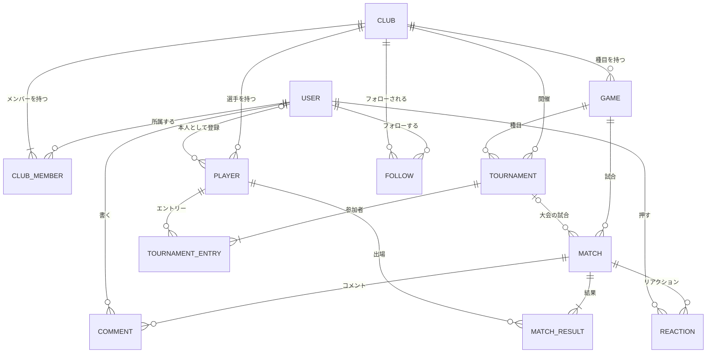

# AIを前面に出さない企画案（追加調査）

2026年10月8日 調査・作成：Claude（Claude Code）

> [テーマ選定 調査レポート](theme-research.md) の追加調査です。条件（[2章](theme-research.md#2-条件の整理)）と評価基準（[4.2節](theme-research.md#42-評価基準と配点100点満点)）はそのまま使い、第2階層で「AI・生成AI」「機械学習」「画像認識」を主役にしない案を考えました。コードの開発は引き続き Claude が担当する前提です。

## 目次

0. [結論](#0-結論)
1. [考え方](#1-考え方aiの代わりに何で技術を見せるか)
2. [候補と採点](#2-候補と採点)
3. [最有力案の詳細：ライバルログ](#3-最有力案の詳細ライバルログ仮称)
4. [そのほかの候補](#4-そのほかの候補)
5. [AI問題集メーカーとの比較と決め方](#5-ai問題集メーカーとの比較と決め方)
6. [参考資料](#6-参考資料)

---

## 0. 結論

### 最有力：「ライバルログ」（仮称）— 対戦記録と大会運営のサービス

> 部活・サークル・友達どうしの対戦結果を記録するだけで、強さ（レーティング）・勝率の予想・対戦成績が自動で見える化される。トーナメント表や総当たり表もボタン1つで作れる。

| 第1階層：ユーザー価値 | 第2階層：技術要素 | 第3階層：対象分野 |
| --- | --- | --- |
| **楽しい**（＋コミュニケーション・便利） | **データ分析・データの可視化**（＋JavaScriptライブラリ活用） | **スポーツ**（＋エンタメ） |

**採点は91点で、前回推奨の「AI問題集メーカー」（86点）を上回った。** 差が付いたのは次の2点。

1. **展示会での盛り上がり**：来場者2人がタブレットで「10秒ストップ」対戦をすると、その場でレートが動き、大画面のランキングとトーナメント表が更新される。
2. **リスクの低さ**：外部APIを使わないので、APIの料金・無料枠・利用規約（年齢制限など）・会場のネット回線に左右されない。

技術の見せ場は、AIの代わりに**数式とアルゴリズム**で作る。強さの計算（イロレーティング）、勝率の予想、トーナメント表の自動作成（シード・不戦勝の処理）、総当たりの対戦順の自動作成、過去の試合を直したときのレート再計算などがある。どれも Claude がテストで正しさを確かめやすく、人間も式で説明できる。

**決め方**：教員が「生成AIの活用」を挑戦度として高く評価するなら AI問題集メーカー、確実に完成させて展示会で盛り上げたいならライバルログ（[5章](#5-ai問題集メーカーとの比較と決め方)）。

---

## 1. 考え方（AIの代わりに何で技術を見せるか）

第2階層のうち、AI系（AI・生成AI、機械学習、画像認識）と IoT（前回の条件で除外）を除くと、主役にできるのは次の4つ。

| 第2階層 | 見せ方 | Claudeとの相性 |
| --- | --- | --- |
| データ分析・データの可視化 | 集計・統計・予測の式、グラフ、ヒートマップ | 計算はテストで確かめやすい |
| WebAPI開発 | 自分たちでAPIを作って公開する（例：大会結果を他のサイトに埋め込む） | テストで確かめやすい |
| JavaScriptのフレームワーク／ライブラリ活用 | リアルタイム更新、アニメーション、ゲーム | 見た目の確認は人間の目が必要 |
| クラウド活用 | インターネットに公開して来場者のスマホから使う | 料金・設定の手間が増える |

AIを使わない案では、**「数式とアルゴリズムで、正しく・速く・無料で・ネットなしで動く」こと自体が技術的な説明材料**になる。「なぜAIを使わないのか」と聞かれたら、「この目的には数式の方が正確で、費用もかからず、結果を説明できるから」と答えられる。

---

## 2. 候補と採点

前回と同じ8つの基準（100点満点）で採点した。各基準を5段階で採点し、配点に換算している。

| 順位 | テーマ | 階層（第1／第2／第3） | 作りやすさ | 短期間 | 技術 | 見栄え | 目的 | 新しさ | 調査 | 低リスク | 合計 |
| --- | --- | --- | --- | --- | --- | --- | --- | --- | --- | --- | --- |
| **1** | **ライバルログ**（対戦記録・強さの見える化・大会運営） | 楽しい／データ可視化／スポーツ | 5 | 5 | 4 | 5 | 4 | 3 | 5 | 5 | **91** |
| 2 | 打って覚えるタイピング（自作の用語集で練習） | 学べる／JSライブラリ／学生生活 | 5 | 4 | 5 | 5 | 3 | 2 | 5 | 3 | 83 |
| 3 | ライブ型クイズ大会（参加者が自分のスマホで同時に回答） | 楽しい／JSライブラリ／エンタメ | 4 | 4 | 4 | 5 | 3 | 2 | 5 | 4 | 79 |
| 4 | アルバイトのシフト自動作成 | 問題解決／データ分析（最適化）／企業業務 | 4 | 3 | 5 | 3 | 5 | 3 | 4 | 4 | 77 |
| 5 | 防災マップ＋備蓄管理（国の公開データを使用） | 安全／データ可視化／防災 | 4 | 4 | 4 | 4 | 5 | 3 | 3 | 3 | 76 |
| 5 | スキル交換マッチング（教え合い） | コミュニケーション／WebAPI開発／学生生活 | 5 | 4 | 4 | 3 | 4 | 3 | 4 | 3 | 76 |
| 7 | デジタル整理券（待ち時間の見える化） | 便利／クラウド活用／地域社会 | 4 | 4 | 4 | 4 | 5 | 3 | 3 | 2 | 74 |
| 8 | 卒業・引っ越しの不用品の譲り合い掲示板 | 環境・SDGs／WebAPI開発／学生生活 | 5 | 4 | 3 | 3 | 4 | 2 | 5 | 3 | 73 |

参考：前回の「AI問題集メーカー」は86点。

主な減点理由：

- **タイピング**：スマホでのタイピングは向かず、「スマホ対応」の条件との相性が悪い。自作の問題を共有できる「マイタイピング」など、似たサービスも多い。
- **ライブ型クイズ大会**：Kahoot! などが無料で使えるので、新しさを出しにくい。問題は手作業で作る必要がある。
- **シフト自動作成**：Airシフト・クックシフトなど自動作成を売りにした既存サービスが多い。画面が地味で展示会向きではなく、条件の作り込みに時間がかかる。
- **防災マップ**：地図の表示にネットが必要。地域を絞ってデータを整える手間がかかる。遊べる要素が弱い。
- **スキル交換**：利用者が少ないうちはマッチングが成り立たない。会って教え合う場面の安全面も考える必要がある。
- **デジタル整理券**：来場者が自分のスマホで順番を確かめるには、サーバーをインターネットに公開する必要があり、展示会のネット回線に頼る。
- **譲り合い掲示板**：ジモティーなどの既存サービスがある。実際の受け渡しで利用者どうしのトラブルが起こりうる。

---

## 3. 最有力案の詳細：ライバルログ（仮称）

名前は仮。チームで自由に決めてよい。

### 3.1 コンセプト

**想定ユーザー（ペルソナ）**

- **メイン**：部活・サークル・地域クラブの運営係。大会の組み合わせ作りや結果の集計を紙やExcelでやっていて、手間がかかっている。
- **サブ**：友達とよく対戦する人（卓球、将棋、ボードゲーム、対戦ゲームなど）。誰が強いのか、自分が強くなっているのかを知りたい。
- **展示会**：年齢を問わない来場者（「10秒ストップ」で対戦する）。

**困りごとと解決策**

| 困りごと | 解決策 |
| --- | --- |
| 大会の組み合わせ作りと結果の集計が手間 | 参加者を選ぶだけでトーナメント表・総当たり表を自動作成。結果を入れると自動で勝ち上がり、順位も計算する |
| 勝ち数だけでは本当の強さが分からない（強い人とばかり当たると損） | イロレーティングで、相手の強さを考慮した点数にする |
| 初心者がやる気を失いやすい | 格上に勝つ「番狂わせ」ほど点数が大きく上がり、画面でも目立たせる。レートの推移で成長が見える |
| 記録が残らず、盛り上がりが続かない | 試合へのコメント・リアクション、ランキング、ライバル（よく当たる相手）との対戦成績 |

企画書の「問題提起」には、クラスのアンケート結果（例：「大会やリーグ戦の集計をしたことがある人のうち、手間だと感じた人の割合」）を入れる。

### 3.2 3階層の当てはめ

| 階層 | 選択 | 根拠 |
| --- | --- | --- |
| 第1階層 | **楽しい**（主）、コミュニケーション・便利（副） | 対戦の盛り上がり。コメントでの交流。大会運営の手間を減らす |
| 第2階層 | **データ分析・データの可視化**（主）、JavaScriptライブラリ活用（副） | レーティング・勝率の予想・対戦成績の集計とグラフ。Chart.js と htmx でグラフと自動更新 |
| 第3階層 | **スポーツ**（主）、エンタメ（副） | 部活・サークルの対戦、ゲームやボードゲーム |

追加機能で「大会結果を他のサイトに埋め込めるAPI」を作れば、「WebAPI開発」も第2階層に加えられる。

### 3.3 機能一覧

**必須（MVP：12月中旬までに完成）**

| 区分 | 機能 |
| --- | --- |
| アカウント | 新規登録、ログイン、ログアウト、プロフィール |
| グループ | 作成、招待コードで参加、権限（管理者・メンバー）、公開／非公開 |
| 種目 | グループ内で種目を登録（例：卓球、将棋）。引き分けの有無 |
| 選手 | アカウントのない人も選手として登録できる |
| 試合の記録 | 対戦相手と勝敗を入力 → レートを自動で更新。試合前に「予想勝率」を表示 |
| 大会 | 参加者を選ぶ → トーナメント（シードと不戦勝を自動で処理）または総当たり（対戦順を自動作成）→ 結果を入れると自動で進行 → 最終順位 |
| 保存 | 試合の履歴、お気に入り（フォローするグループ）、マイページ（自分の成績まとめ） |
| 共有 | 種目ごとのランキング、試合へのコメントとリアクション、大会ページのURL共有 |
| 分析 | レートの推移、勝率、相手別の相性表（ヒートマップ）、曜日・時間帯ごとの試合数、番狂わせランキング |
| 管理 | Django の管理サイト |
| 共通 | レスポンシブ表示、エラー画面、ログ |

**追加（MVPのあと、1月中に）**

| 機能 | 内容 |
| --- | --- |
| 展示会モード | 「10秒ストップ」で2人が対戦 → 結果を自動で記録 → 大画面にランキングと「番狂わせ速報」を数秒ごとに自動表示 |
| 結果の承認 | 試合結果を、対戦相手も確認してから確定する（なりすましの入力を防ぐ） |
| 3人以上の対戦 | 順位をつける対戦（ボードゲームなど）にも対応。ペアごとの勝ち負けに分けてレートを計算する |
| 埋め込みAPI | 大会の途中経過をJSONで返すAPI。他のサイトに結果を載せられる（WebAPI開発） |

**余裕があれば**：シーズン制（期間ごとにレートをリセット）、バッジ、CSV出力、ダークモード。

**スコープ管理のルール**：追加機能は MVP が完成してから着手する。2/5 以降は新しい機能を入れない。

### 3.4 必須機能（保存・共有・分析）との対応

| 必須機能 | 実装 |
| --- | --- |
| 保存（お気に入り・履歴・マイページ） | 試合の履歴、フォローしたグループ、マイページの成績まとめ |
| 共有（ランキング・レビュー・コメント） | 種目ごとのランキング、試合へのコメントとリアクション、大会ページの共有 |
| 分析（統計・トレンドの可視化） | レートの推移、勝率、相性表、試合数の時間帯分布、番狂わせランキング |

### 3.5 画面一覧（案）

| # | 画面 | 主な内容 |
| --- | --- | --- |
| 1 | トップ | サービス紹介、最近の試合、注目の番狂わせ |
| 2 | 新規登録・ログイン | |
| 3 | マイページ | 自分のレート推移、勝率、ライバル |
| 4 | グループ | メンバー、種目、ランキング、最近の試合 |
| 5 | 試合を記録 | 相手と勝敗の入力、予想勝率、記録後のレート変化（アニメーション） |
| 6 | 試合の詳細 | 結果、レート変化、コメント、リアクション |
| 7 | 選手の詳細 | レート推移グラフ、相手別の成績 |
| 8 | 大会を作る | 形式（トーナメント・総当たり）と参加者の選択、シード順 |
| 9 | 大会の表 | トーナメント表／総当たり表、結果入力、自動での勝ち上がり |
| 10 | ランキング | 種目ごとの順位、番狂わせランキング |
| 11 | 分析 | 相性表（ヒートマップ）、時間帯ごとの試合数 |
| 12 | 展示会モード（追加） | 10秒ストップの対戦画面、大画面用のランキング |
| 13 | 管理サイト | Django 標準 |

### 3.6 DB設計（案）



| テーブル | 主な列 | 制約・ポイント |
| --- | --- | --- |
| users（Django標準） | id, username, password, email | username はユニーク。password はソルト付きハッシュ |
| clubs | id, name, description, visibility, invite_code, created_by, created_at | invite_code はユニーク。Django 標準の「Group」と名前がぶつからないよう club とする |
| club_members | id, club_id, user_id, role（owner／admin／member） | (club_id, user_id) はユニーク |
| players | id, club_id, user_id（NULL可）, display_name | (club_id, display_name) はユニーク。アカウントのない人も登録できる |
| games | id, club_id, name, match_type（1対1／複数人）, allow_draw | (club_id, name) はユニーク |
| matches | id, game_id, played_at, recorded_by, tournament_id（NULL可）, round_no, slot_no, status | 大会の試合は (tournament_id, round_no, slot_no) がユニーク |
| match_results | id, match_id, player_id, result（勝ち・引き分け・負け、または順位）, rating_before, rating_after | (match_id, player_id) はユニーク |
| tournaments | id, club_id, game_id, name, format（トーナメント／総当たり）, status, created_at | 外部キー2つ |
| tournament_entries | id, tournament_id, player_id, seed | (tournament_id, player_id) と (tournament_id, seed) はユニーク |
| comments | id, match_id, user_id, body, created_at | 外部キー2つ |
| reactions | id, match_id, user_id, kind | (match_id, user_id, kind) はユニーク |
| follows | id, user_id, club_id, created_at | (user_id, club_id) はユニーク |

**設計のポイント（説明用）**

- **現在のレートは別に保存しない。** 最新の試合の rating_after から求める（チェックリスト「同じ情報を複数のテーブルに重複させていない」）。
- **過去の試合を直したら、レートを最初から計算し直す。** その種目の試合を古い順に並べ、順番に計算し直す。何度やっても同じ結果になる処理なので、テストで確かめやすい。
- **勝ち数・勝率は保存せず、集計で求める。**

### 3.7 技術の見どころ（教員への説明材料）

**1. イロレーティング（強さの計算）**

チェスなどで使われている計算方法。

```
予想勝率  E_A = 1 / (1 + 10^((R_B − R_A) / 400))
新レート  R_A' = R_A + K × (S_A − E_A)    （S_A は勝ち=1、引き分け=0.5、負け=0）
```

例：Aさん（1600）とBさん（1400）が対戦すると、Aさんの予想勝率は約76%。K=32 の場合、

- Aさんが勝つと、Aさん +7.7、Bさん −7.7（予想どおりなので変化は小さい）
- Bさんが勝つと、Bさん +24.3、Aさん −24.3（番狂わせなので大きく動く）

「勝ち数ではなく、相手の強さを考えた点数になる」「予想勝率はAIではなく式で出している」と説明できる。試合数が少ない人はKを大きくして早く実力に近づける工夫もできる（国際チェス連盟は、試合数の少ない新人に大きいKを使っている）。

**2. トーナメント表の自動作成**

参加人数を2の累乗（8、16…）に切り上げ、空いた枠は上位シードの不戦勝にする。1位と2位のシードが決勝まで当たらない並べ方にする。2人から32人まで、すべての人数でテストする。

**3. 総当たりの対戦順の自動作成**

「サークル方式」で、全員が全員と1回ずつ当たり、同じ回に同じ人が2試合入らない組み合わせを作る。人数が奇数なら「休み」を1つ足す。

**4. 同時に入力されても壊れない**

2人が同時に結果を入れても、レートの計算が混ざらないよう、トランザクションで処理を1つずつ順番に行う。

**5. 権限（認可）**

非公開グループは、URLを推測して開いても見られない。試合を記録できるのはメンバーだけ、削除できるのは管理者だけ。ログイン（認証）に加えて、「誰が何をしてよいか」（認可）をテストで確かめる。

**6. 集計と可視化**

勝率・相性表・時間帯ごとの試合数は SQL の集計（GROUP BY）で求め、JSONを返す自前のWeb APIから Chart.js で描く。

**7. リアルタイム更新**

大画面のランキングは htmx で数秒ごとに自動更新する。レートが動いたらアニメーションで知らせる。

### 3.8 技術スタック

前回の推奨構成から、生成AI APIを除いたもの。

| 区分 | 採用技術 |
| --- | --- |
| 動作環境 | Windows 10／11 |
| 言語・フレームワーク | Python 3.12 または 3.13、Django 5.2 LTS |
| データベース | SQLite（必要なら MySQL／MariaDB に切り替え） |
| CSSフレームワーク | Bootstrap 5.3 ＋ Bootstrap Icons |
| JavaScript | Chart.js（グラフ）、htmx（自動更新）、少しの素のJS＋CSSアニメーション |
| 外部API | 使わない |
| 展示会での起動 | waitress（Windowsで動くWebサーバー）＋ `DEBUG=False` |
| テスト・CI | Django のテスト機能、coverage、GitHub Actions（Linux と Windows でテスト） |

### 3.9 チェックリスト対応（前回の案との違い）

| チェック項目 | 対応 |
| --- | --- |
| APIキー管理（WebAPIを使う場合） | 外部APIを使わないので対象外。`SECRET_KEY` などの設定値は同じく `.env` に置く |
| APIモックでオフライン検証 | 外部APIがないので、アプリ全体がネットなしで動く。展示会もネット不要 |
| ディレクトリトラバーサル | ファイルのアップロードがないので、危険が生じにくい（プロフィール画像などを足す場合は、前回と同じくUUIDのファイル名・拡張子の許可リストで対応） |
| 間違った操作・想定外の入力のテスト | 例：自分自身との対戦、同じ試合の二重登録、1人だけの大会、他人の非公開グループを直接開く |

認証・DB・UI・アニメーション・ログ・XSS・SQLインジェクション・展示会前の準備は、前回の案と同じ方法で対応する（[前回の5.10節](theme-research.md#510-チェックリスト対応表)）。

### 3.10 想定される質問と答え方

| 質問 | 答え方 |
| --- | --- |
| 勝ち数で並べればよくない？ | 強い人とばかり当たる人が損をする。イロレーティングなら相手の強さを考えた点数になる（例を見せる） |
| Tonamel やスタートプレーヤーと何が違う？ | Tonamel は大会運営（主にeスポーツ・カードゲーム）、スタートプレーヤーはボードゲームの記録とレーティング。こちらはスポーツもゲームも含めた身近なグループ向けに、レーティングと大会運営を一体にし、予想勝率と番狂わせの演出を加えた |
| レートの計算は正しい？ | 式どおりの値になることを、具体的な数値のテストで確かめている |
| うその結果を入れられたら？ | 記録はメンバーだけができ、誰が入れたかが残る。追加機能で、対戦相手の承認を必須にする |
| 同時に入力したら？ | トランザクションで1件ずつ順番に処理するので、レートが壊れない |
| なぜAIを使わない？ | 強さの計算や組み合わせ作りは、数式の方が正確で、費用もかからず、ネットなしで動き、結果の理由も説明できる |
| 遊びのアプリでは？ | 大会運営の手間を減らすことが目的。8人のトーナメント表を作る時間を、手作業とアプリで比べた結果を示す |

### 3.11 展示会での見せ方

**ブースの構成**

- チームのWindowsノートPC（サーバー）＋大きめのモニター（ランキング、トーナメント表、番狂わせ速報）
- 対戦用のタブレット2台
- ネットは不要。PCとタブレットは、チームのWi-Fiルーターかスマホのテザリングでつなぐ

**体験の流れ（1組2〜3分）**

1. 2人がニックネームを入れる（家族や友達どうしで来る人が多い。1人ならスタッフと対戦）
2. 「10秒ストップ」：スタートを押し、10秒たったと思ったらストップを押す。10.00秒に近い方が勝ち
3. 結果が自動で記録され、レートが動く。大画面のランキングが更新される

1時間ごとに「8人トーナメント」を開き、トーナメント表が大画面で進んでいく様子を見せる。

**見せ場**

1. 予想勝率の表示（「この対戦、Aさんが勝つ確率は76%」）
2. 番狂わせでレートが大きく動く演出
3. トーナメント表の自動進行
4. その日の展示会のデータ分析（何試合あったか、時間帯ごとの来場の様子）

### 3.12 ユーザー調査（クラス内で完結）

| 時期 | 方法 |
| --- | --- |
| 10月 | アンケート（部活・サークル・ゲーム仲間での記録や大会の運営方法、困っていること）と聞き取り |
| 12月〜1月 | **クラス内リーグを2週間ほど開く**（休み時間の10秒ストップや、クラスメイトがよく遊ぶゲームなど）。実際に使ってもらい、記録・コメント・ランキングの使われ方を観察する |
| 2月 | SUS（使いやすさの点数）、利用データ（試合数、コメント数）、8人のトーナメント表を作るのにかかる時間（手作業とアプリの比較） |

クラスメイトが実際の利用者になり、実データがたまるので、最終プレゼンで「実際に使われた結果」を示せる。

### 3.13 分担例（5人の場合）

| 担当 | 主な責任 |
| --- | --- |
| リーダー（PM） | スケジュール、Issue 管理、必須工程の提出物、プレゼンの構成 |
| レーティング・分析担当 | イロレーティング、再計算、グラフ・相性表 |
| 大会担当 | トーナメント表・総当たり表の自動作成と進行 |
| グループ・共有担当 | グループ・招待・権限、コメント・リアクション・フォロー |
| UI/UX・展示会担当 | デザイン、10秒ストップ、大画面表示、ユーザー調査の運営 |

Claude との分担・開発の流れ・説明できるようにする仕組みは、前回のレポートと同じ（[6章](theme-research.md#6-開発の進め方claude中心)）。

### 3.14 似たサービスとの違い

| サービス | 特徴 | ライバルログとの違い |
| --- | --- | --- |
| Tonamel（KAYAC） | 大会の募集から組み合わせ・結果発表まで無料で運営できる。トーナメント、スイス式、総当たりなどに対応。eスポーツ・カードゲームの大会が中心 | 大会だけでなく、日々の対戦のレーティングと成長の記録を一体で扱う。スポーツの部活やサークルも対象 |
| スタートプレーヤー（バックムーン） | ボードゲームの勝敗・順位・点数をグループで記録し、レーティングを自動で計算する無料サービス | ボードゲームに限らない。大会運営と予想勝率・番狂わせの演出を持つ |
| Board Record などの海外アプリ | ボードゲームの成績を記録・集計する（英語） | 日本語で、大会運営まで一体 |

---

## 4. そのほかの候補

### 4.1 打って覚えるタイピング（83点）

- **内容**：IT用語・英単語・歴史の年号などの用語集を、タイピングしながら覚えるゲーム。自分で作った用語集を共有でき、苦手なキーと苦手な単語を分析する。
- **階層**：学べる・楽しい × JavaScriptライブラリ活用・データ可視化 × 学生生活
- **技術の見どころ**：ローマ字入力の判定（「し」を si・shi・ci のどれで打っても正解にする状態遷移）、キーごとのミス率をキーボードの図に色で表すヒートマップ、スコアの改ざん対策（打鍵の記録からサーバー側で計算し直す）。
- **強み**：展示会で最も人が集まりやすい部類。判定のアルゴリズムはテストで確かめやすい。
- **弱み**：スマホでのタイピングに向かない（スマホでは結果・ランキング・用語集の作成だけにするなど工夫が必要）。寿司打・e-typing・マイタイピングなど似たものが多い。
- **選ぶべき場合**：とにかく展示会で人を集めたいとき。

### 4.2 ライブ型クイズ大会（79点）

- **内容**：主催者が作ったクイズに、参加者が自分のスマホから同時に答える（早く正解するほど高得点）。結果と問題ごとの正答率を分析する。
- **技術の見どころ**：全員の画面を同時に進めるリアルタイム処理、サーバーの時刻を基準にした公平な早押し判定。
- **弱み**：Kahoot! などが無料で使えるので新しさを出しにくい。問題を手作業で作る必要がある。

### 4.3 アルバイトのシフト自動作成（77点）

- **内容**：小さなお店の店長が、スタッフの希望と時間帯ごとの必要人数から、シフト表を自動で作る。
- **技術の見どころ**：条件つきの最適化（Pythonの数理最適化ライブラリ）、店長とスタッフの権限分け、人件費の集計。
- **強み**：商業的な価値が分かりやすく、技術的にも重い。
- **弱み**：自動作成をうたう既存サービスが多い（Airシフト、クックシフトなど）。画面が地味で展示会に向かない。条件の作り込みに時間がかかる。

### 4.4 防災マップ＋備蓄管理（76点）

- **内容**：自宅の近くの指定緊急避難場所を地図で確かめ、家族の備蓄品を期限つきで管理する（使いながら買い足すローリングストック）。
- **データ**：国土地理院の「指定緊急避難場所データ」（CSV・GeoJSON）。国土地理院のコンテンツ利用規約に従い、出典を書けば使える。誰にも頼まずに入手できる。
- **強み**：社会的な価値が高く、保護者に響く。
- **弱み**：地図の表示にネットが必要。地域を絞ってデータを整える手間がかかる。遊べる要素が弱い。

### 4.5 その他

| 案 | 一言 |
| --- | --- |
| スキル交換マッチング（76点） | 教え合いの組み合わせを作るアルゴリズムは面白いが、利用者が少ないうちは成り立たない |
| デジタル整理券（74点） | 自分たちの展示ブースで使える点は魅力。来場者のスマホから使うには、サーバーをインターネットに公開する必要がある |
| 譲り合い掲示板（73点） | 卒業時期と重なり、クラスメイトが実際に使える。既存サービスが多く、受け渡しでのトラブルも心配 |

---

## 5. AI問題集メーカーとの比較と決め方

| 基準 | 配点 | AI問題集メーカー | ライバルログ | 差が出た理由 |
| --- | --- | --- | --- | --- |
| Claudeの作りやすさ | 15 | 15 | 15 | |
| 短期間で完成 | 15 | 15 | 15 | |
| 技術の深さ・説明しやすさ | 15 | 12 | 12 | 生成AIの組み込み と 数式・アルゴリズム。種類は違うが同程度 |
| 見栄え・デモ映え | 15 | 12 | 15 | 展示会でのライブ対戦・トーナメント表・番狂わせの演出 |
| 目的の明確さ | 10 | 8 | 8 | |
| 新しさ | 10 | 6 | 6 | どちらも似たサービスがある |
| クラス内の調査 | 10 | 10 | 10 | |
| リスクの低さ | 10 | 8 | 10 | 外部API・利用規約・ネット回線に頼らない |
| **合計** | 100 | **86** | **91** | |

**AI問題集メーカーを選ぶ場合**

- 教員が「生成AIの活用」を挑戦度として高く評価する。
- 「学習」という真面目な目的で勝負したい。

**ライバルログを選ぶ場合**

- 確実に完成させて、展示会で盛り上げたい。
- 外部サービスの料金・規約・回線に振り回されたくない。
- 「遊び」に見えないよう、「大会・サークル運営の手間を減らす」ことを目的として打ち出せる。

ご依頼の条件（短期間・見た目と技術の両方で納得・チーム内で完結）に最もよく合うのは**ライバルログ**。どちらにするか迷ったら、担当教員に「生成AIを使うことを評価で重視するか」を確認して決めるとよい。

---

## 6. 参考資料

2026年10月8日に確認。

**似たサービス**

- [Tonamel（KAYAC）](https://www.kayac.com/en/service/gc)：大会運営プラットフォーム
- [スタートプレーヤー（琉球新報の記事）](https://ryukyushimpo.jp/news/entry-1039744.html)：ボードゲームの対戦記録とレーティング
- [Board Record（App Store）](https://apps.apple.com/app/board-record/id1598527865)
- [マイタイピング（App Store）](https://apps.apple.com/jp/app/id1122398612)：自作のタイピングゲームを共有できるアプリ
- [クックシフト（App Store）](https://apps.apple.com/jp/app/id6741349094)：飲食店向けのシフト自動作成アプリ
- [Airシフトの紹介（ミツモア）](https://meetsmore.com/products/air-shift)

**技術・データ**

- [Elo レーティングの計算例（Coddy）](https://coddy.tech/chess/ja/tools/elo-calculator)
- [Empirical parameterization of the Elo Rating System（arXiv）](https://arxiv.org/pdf/2512.18013)
- [国土地理院：指定緊急避難場所データ](https://www.gsi.go.jp/bousaichiri/hinanbasho.html)
- [国土地理院コンテンツ利用規約](https://www.gsi.go.jp/kikakuchousei/kikakuchousei40182.html)
