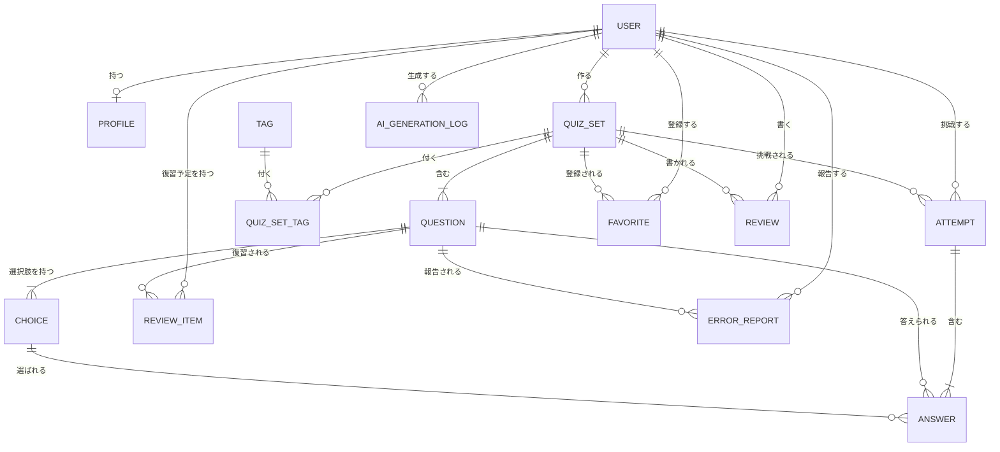
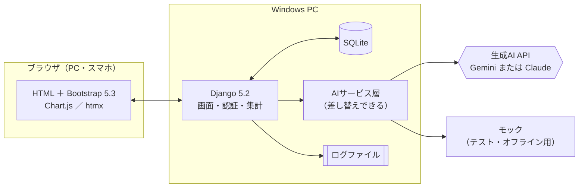
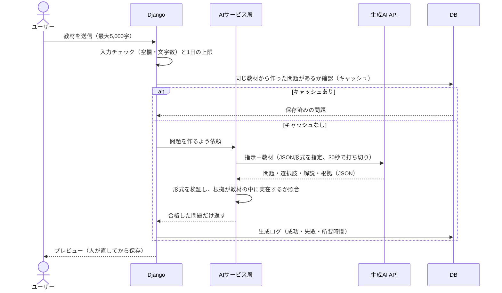

# 卒業制作Ⅱ テーマ選定 調査レポート

2026年10月8日 調査・作成：Claude（Claude Code）

> [概要説明](overview.md) と [チェックリスト](checklist.md) を絶対条件として、「何を作るのがいちばん良いか」を調べてまとめたものです。テーマはチームで話し合って決めてください。

## 目次

0. [結論](#0-結論)
1. [調査の進め方](#1-調査の進め方)
2. [条件の整理](#2-条件の整理)
3. [調査結果](#3-調査結果)
4. [候補の比較](#4-候補の比較)
5. [推奨テーマの詳細](#5-推奨テーマの詳細ai問題集メーカー仮称トイカケ)
6. [開発の進め方（Claude中心）](#6-開発の進め方claude中心)
7. [スケジュール案](#7-スケジュール案)
8. [ユーザー調査・評価の計画](#8-ユーザー調査評価の計画クラス内で完結)
9. [展示会・発表での見せ方](#9-展示会発表での見せ方)
10. [リスクと対策](#10-リスクと対策)
11. [次点の候補](#11-次点の候補と選ぶべき場合)
12. [次のアクション](#12-次のアクションチームで決めること)
13. [用語](#13-用語)
14. [参考資料](#14-参考資料)

---

## 0. 結論

> **決定（2026年10月8日）** 検討の結果、テーマは「ネット詐欺見抜きトレーニング」（[別紙2の3.1節](theme-research-more.md#31-ネット詐欺見抜きトレーニング仮称ミヌケル-89点)）に決まりました。要件は[要件定義書](requirements.md)にまとめています。
>
> **追記：AIを前面に出さない案** 別紙「[AIを前面に出さない企画案](theme-research-non-ai.md)」で検討した「ライバルログ」（対戦記録・強さの見える化・大会運営）が91点となり、この章の推奨案（86点）を上回りました。どちらを選ぶかの決め方は[別紙の5章](theme-research-non-ai.md#5-ai問題集メーカーとの比較と決め方)にあります。
>
> **追記：その他の企画案** 別紙2「[その他の企画案](theme-research-more.md)」で新しく15案を検討し、全レポートを通した総合ランキングと選び方を[別紙2の5章](theme-research-more.md#5-全レポートの総合ランキングと選び方)にまとめました。

### 推奨テーマ：「AI問題集メーカー」（仮称：トイカケ）

> 教材を貼るだけで、AIが「根拠つき」の問題集を作る。忘れる前に出し直してくれて、苦手が見える。問題集はみんなで共有して評価し合える。

| 第1階層：ユーザー価値 | 第2階層：技術要素 | 第3階層：対象分野 |
| --- | --- | --- |
| **学べる**（＋楽しい） | **AI・生成AI**（＋データ分析・データの可視化） | **学生生活** |

### 選んだ理由

1. **Claudeがほぼ全部作れる。** 中身は「文章の入出力＋DB＋グラフ」で、マイクやカメラなどの実機を使わない。Claudeが自動テストで自分の作業を確かめられるので、手戻りが少ない。
2. **短期間で完成する。** 最小限の完成形（MVP）は12月中旬に動く規模。1/14の中間プレゼンでは実際に動くデモを見せられる。
3. **教員が納得しやすい。** AIの誤り（ハルシネーション）を根拠の照合で自動検出する仕組み、復習のアルゴリズム、DBでの集計とグラフ、セキュリティ対策など、技術的に説明できる見どころが多い。
4. **チーム内で完結する。** 学校の他部署や外部の協力がいらない。教材はユーザー自身が入力し、初期データはチームとAIで作れる。クラスメイト自身が本物の想定ユーザーなので、ユーザー調査もクラス内で自然に成り立つ。
5. **展示会で映える。** 来場者が好きなテーマのクイズを2〜3分で体験でき、ランキングがその場で更新される。

### 推奨の技術構成

**Python 3.12/3.13 ＋ Django 5.2 LTS ＋ SQLite ＋ Bootstrap 5.3 ＋ Chart.js ＋ 生成AI API 1つ**

生成AI APIは、費用0円で始めるなら **Gemini API の無料枠**、お金を少し払っても安定させたいなら **Claude API**（[3.1節](#31-生成ai-api料金無料枠規約)）。

### 次点

「AI話し方トレーナー」（プレゼン・面接の練習）。見栄えと共感はいちばん強い。ただしマイク・音声認識・HTTPSなど実機に頼る部分が多く、Claudeが自分で動作を確かめられないため、開発期間とリスクが増える（[11章](#11-次点の候補と選ぶべき場合)）。

---

## 1. 調査の進め方

- リポジトリの [概要説明](overview.md) と [チェックリスト](checklist.md) から条件を洗い出した。
- 2026年10月時点の公開情報をWebで調べた。対象は、生成AI APIの料金・無料枠・規約、フレームワークのサポート期間、Claude Code の動作環境、似たサービス、使いやすさの評価方法（出典は [14章](#14-参考資料)）。
- 「Claudeがコードを書き、人間が細かな修正をする」前提で、14種類のテーマ案を条件でふるい分け、残った8案を採点した。

> **注意**：Google の公式ドキュメント（ai.google.dev）は調査環境から直接開けなかった。Gemini API の無料枠の具体的な回数は、検索結果と開発者フォーラムからの情報にとどまる。使う前に AI Studio で、自分たちのプロジェクトの上限を必ず確認すること。

---

## 2. 条件の整理

### 2.1 絶対条件（概要説明・チェックリストより）

| # | 条件 | 推奨案での対応 |
| --- | --- | --- |
| 1 | 第1〜第3階層から1つ以上ずつ選ぶ | 学べる × AI・生成AI × 学生生活 |
| 2 | DBを使って「保存・共有・分析」を組み込む | 保存＝履歴・お気に入り・マイページ／共有＝公開問題集・レビュー・ランキング／分析＝正答率の推移・苦手なタグ・全体の統計 |
| 3 | 他チームのメンバーとユーザー調査をする（企画時・制作途中・完成後） | クラスメイト自身が想定ユーザー（[8章](#8-ユーザー調査評価の計画クラス内で完結)） |
| 4 | 一般の方の利用を想定する | 18歳以上の学習者（学生、資格を目指す社会人） |
| 5 | 展示会・発表会で紹介できる | 来場者向けの「展示会モード」（[9章](#9-展示会発表での見せ方)） |
| 6 | Windows上で動く PHP / Java / Python のフレームワーク | Python ＋ Django |
| 7 | DB必須・テーブル3つ以上 | 主要テーブル14個（[5.6節](#56-db設計案)） |
| 8 | Bootstrap か Tailwind CSS を使う | Bootstrap 5.3 |
| 9 | スマホ対応のレスポンシブデザイン | モバイルファーストで画面を設計 |
| 10 | 制作物の技術説明ができる | 担当制、技術説明資料、模擬質疑（[6.4節](#64-全員が説明できるようにする仕組み)） |
| 11 | 必須工程9つ、プレゼン3回 | スケジュールに組み込み済み（[7章](#7-スケジュール案)） |
| 12 | チェックリストの全項目 | 対応表（[5.10節](#510-チェックリスト対応表)） |

### 2.2 チームから出た条件

| 条件 | 解釈 |
| --- | --- |
| 基本はAIが大部分を作り、人間が細かな修正をする | **コードの開発は基本的にClaudeが行う。** 人間は、やることを決める・レビューする・実機で確かめる・画面の文言や色を直す・AIへの指示文を調整する・ユーザー調査と発表をする |
| なるべく短期間で開発できる | 12月中旬にMVP、1/14の中間プレゼンで実際に動くデモ |
| 見た目でも技術面でも教員が納得する | 見せ場（アニメーション・グラフ・即時更新）と、説明できる技術ポイントの両方を用意する |
| すべてチーム内で完結する | 学校の他部署・外部の団体・企業に話を聞きに行ったり、データの提供を頼んだりしなくてよい |

### 2.3 追加で定義した条件

チームの条件を満たすために、次の条件を加えた。テーマの採点にも使っている。

| # | 条件 | 理由 |
| --- | --- | --- |
| R1 | 費用は0円〜数百円程度。無料枠が中心で、有料にしても$5前後をチーム内で払える範囲 | 学生チームで完結させるため |
| R2 | 中心となる機能が、マイク・カメラ・GPS・センサーなどの実機に頼らず、自動テストで確かめられる | Claudeは実機を操作できない。自分でテストして確かめられる範囲が広いほど、早く正確に作れる |
| R3 | 学校PCの制約に左右されない（管理者権限なしで動く。開発はブラウザ版の Claude Code でもできる） | ソフトのインストール許可を学校に頼まなくて済むように |
| R4 | 展示会に強い（ネットが遅い・ないときも主要機能が動く。1人2〜3分で体験が終わる。何人かで同時に楽しめる） | チェックリスト「展示会前」の項目に対応 |
| R5 | チーム全員が自分の担当箇所を説明できる構成（定番の作り、外部サービスは最小限） | 「技術説明ができる」「教員の技術レビュー」に対応。Claudeが書いたコードを説明できないことが最大のリスク |
| R6 | 初期データを自分たちで用意できる（外部からデータ提供を受けない） | チーム内で完結させるため |
| R7 | クラスメイトが本物の想定ユーザーになる | ユーザー調査をクラス内で自然に回せる |
| R8 | 規約・法令に反しない（AI APIの年齢制限と入力データの扱い、著作権、病歴などの要配慮個人情報を扱わない） | 質疑で聞かれても答えられるように |
| R9 | 4〜5人で偏りなく分担できる | 評価観点「チームワーク（作業の偏りがない）」 |
| R10 | 「それ、ChatGPTに頼めばよくない？」に答えられる（DBにためたデータがあってこその価値がある） | 生成AIを使う作品で必ず聞かれる質問 |
| R11 | MVPが12月中旬までに動く規模 | 中間プレゼン（1/14）からは「実際に動くこと」が評価される |

また、**卒業アルバムと展示会運営を担当する1チームには立候補しない**ことを勧める。他チームや学校との調整が欠かせず、「チーム内で完結」の条件に合わない。

---

## 3. 調査結果

### 3.1 生成AI API（料金・無料枠・規約）

チェックリストに「外部APIは1つに絞って深掘りする」とあるので、外部APIは生成AIの1つだけにする。

| 項目 | Gemini API（無料枠） | Gemini API（有料枠） | Claude API |
| --- | --- | --- | --- |
| 料金（100万トークンあたり 入力／出力） | 0円（Flash-Lite系など、無料枠のあるモデルに限る） | 例：Gemini 3.1 Flash-Lite $0.25／$1.50 | Haiku 5.5 $0.10／$0.50、Sonnet 5.5 $2／$10、Opus 5.5 $4／$20 |
| 始め方 | Googleアカウントで AI Studio からキーを発行 | 請求先アカウントの登録と、$5以上の前払い | Console でクレジットを購入（主要クレジットカード）。新規ユーザーには少額の無料クレジットあり |
| 送った内容の扱い | Googleの製品改善に使われる（人が確認することもある） | 製品改善に使われない | 商用規約で、送った内容をモデルの学習に使わないと定めている |
| 年齢の扱い | 利用は18歳以上。18歳未満向け、または18歳未満が使う可能性が高いアプリでは使えない | 同左 | 18歳未満が使う製品は、追加の安全対策を条件に認められている |
| 安定性 | ベストエフォート。2025年末に一部モデルの無料上限が大きく下がった報告がある（1日250回→20回など） | 安定 | 安定 |
| 画像の入力 | 対応 | 対応 | 対応 |
| JSON形式での出力の指定 | 対応 | 対応 | 対応（Structured Outputs） |

**1回の問題生成にかかる費用の目安**

入力約4,000トークン（指示＋教材3,000〜4,000字程度）、出力約4,000トークン（5問分の問題・解説・根拠と、AIが考える分）と仮定した概算。トークン数は言語やモデルによって変わる。

| モデル | 1回あたり | $5で作れる回数 | 制作期間全体（約800回と想定） |
| --- | --- | --- | --- |
| Gemini（無料枠） | 0円 | ― | 0円（1日の上限内なら） |
| Gemini 3.1 Flash-Lite（有料枠） | 約$0.007 | 約700回 | 約$5.6 |
| Claude Haiku 5.5 | 約$0.0024 | 約2,000回 | 約$1.9 |
| Claude Sonnet 5.5 | 約$0.048 | 約100回 | 約$38 |
| Claude Opus 5.5 | 約$0.096 | 約50回 | 約$77 |

800回の内訳の想定：開発中の実接続確認 約300回、ユーザーテスト 約200回、展示会 約300回（実際は事前に作った問題を使うので、もっと少なくなる）。

**このテーマへのおすすめ**

- **Gemini API の無料枠で始める。** 費用0円で、Googleアカウントだけで完結する。ただし無料枠は予告なく減ることがあるので、次の3つを必ず作る。
  1. **モック**（決まった問題を返す、AIの代わりの仮の実装）。自動テストと、ネットがない展示会で使う。
  2. **キャッシュ**。同じ教材から作った問題はDBに保存して使い回し、APIを呼ぶ回数を減らす。
  3. **1人1日の生成回数の上限**。使いすぎを防ぐ。
- 無料枠で足りなくなったら、`.env` の設定を変えるだけで有料のAPI（Gemini の有料枠、または Claude API）に移れる作りにしておく。どの場合も、**同時に使う外部APIは1つ**。
- Claude API を使う場合、モデルはチームで選ぶ（費用を抑えるなら Haiku 5.5、品質を優先するなら Opus 5.5）。Claude Code はモデルの指定がないと上位のモデル（現在は Opus 5.5）でコードを書くことがあるので、使うモデル名を `.env` と CLAUDE.md で指定しておく。
- **年齢制限への対応（重要）。** Gemini API の規約は「18歳未満が使う可能性が高いアプリ」での利用を禁じている。そこで、**AIで問題を作る機能は、18歳以上であることを確認したログインユーザーに限る。** 展示会の来場者（高校生や子どもを含む）は、**事前に作っておいた問題で遊ぶ**形にする。Claude API に切り替えても、この設計のままで問題ない。
- 無料枠では入力が製品改善に使われるので、入力画面に「入力内容は外部のAIサービスに送信されます。個人情報や人に見せたくない内容は入力しないでください」と表示する。

### 3.2 フレームワークと技術

「Claudeが書きやすく、人間が説明しやすいこと」を重視して比べた。

| 観点 | Python ＋ Django | PHP ＋ Laravel | Java ＋ Spring Boot |
| --- | --- | --- | --- |
| サポート期間 | 5.2 LTS はセキュリティ修正が2028年4月まで（最新は6.1、2026年8月公開） | Laravel 13 が2026年3月公開（サポート期間は公式で要確認） | ― |
| パスワードのハッシュ化 | 標準で PBKDF2-SHA256（5.2は100万回の繰り返し）＋ランダムなソルト | 標準で bcrypt（ソルト込み） | Spring Security の BCrypt |
| SQLインジェクション・XSS・CSRF | ORM（プレースホルダ）、テンプレートの自動エスケープ、CSRFトークンが標準 | 同等の機能が標準 | 同等の機能を設定して使う |
| 管理画面 | 標準の管理サイトで、初期データの登録や投稿の管理がすぐできる | 別に作るか、パッケージを入れる | 別に作る |
| 生成AI・データ分析との相性 | 主要AIのSDKがそろい、集計も得意 | SDKはあるが選択肢は少なめ | SDKはある |
| Windowsでの動かしやすさ | Python（ユーザー単位でインストールできる）と SQLite だけで動く。DBサーバーがいらない | PHP＋Composer（XAMPP など） | JDK＋Maven/Gradle |
| Claudeとの相性 | とても良い（情報が多く、書き方の定番が決まっている） | 良い | 良いが、書くコードの量が多い |

**結論：Python ＋ Django 5.2 LTS。** チェックリストのセキュリティ項目の多くを標準機能で満たせるので、AIがセキュリティ処理を自前で書いて間違える余地が小さい。LTS（長期サポート版）を選んだことも、教員に説明しやすい。チームが PHP の方が得意なら、Laravel でも同じ設計で作れる（Django を推す差は大きくない）。

その他の選定：

| 区分 | 採用 | 理由 |
| --- | --- | --- |
| DB | SQLite（Django標準） | インストール不要で、ファイル1つで動く。展示会のオフライン環境にも強い。外部キー・ユニーク・NOT NULL の制約も使える。教員から MySQL を求められたら、Django の設定変更で MySQL/MariaDB（XAMPP）に移せる |
| CSS | Bootstrap 5.3 | ビルド作業がいらず、ファイルを置くだけで使える。モーダル・トースト・プログレスバーなどの部品があり、チェックリストのアニメーション例（ふわっと表示・揺れる・色が変わる）を作りやすい。v6 は開発中なので 5.3 系を使う |
| グラフ | Chart.js | 折れ線・棒・レーダーチャートを手軽に描ける |
| 画面の部分更新 | htmx（必要な箇所だけ） | ランキングの自動更新などを、JavaScriptをほとんど書かずに作れる。サーバー側のテストで確かめやすい |
| 展示会での起動 | waitress（Windowsで動くWebサーバー）＋ `DEBUG=False` | 開発用サーバーではなく、本番に近い形で動かせる |
| CSS・JSの置き場所 | CDNを使わず、リポジトリ内に置く | ネットがない会場でも見た目が崩れない |

### 3.3 Claudeを中心にした開発の環境

| 項目 | 内容 |
| --- | --- |
| Claude Code（ブラウザ版） | claude.ai/code から使える。クラウドで動くので、学校PCに何もインストールしなくてよい。GitHubのリポジトリを読み書きし、作業結果をブランチやプルリクエストで返す。Pro / Max / Team などの有料プランが必要 |
| Claude Code（Windows版） | PowerShell から管理者権限なしでインストールできる（Git for Windows を入れておくのがおすすめ） |
| Windowsでの動作確認 | ブラウザ版の Claude Code は Linux で動く。Windows で動くことは、GitHub Actions の Windows 環境で毎回テストして確かめる。このリポジトリは公開設定なので、GitHub Actions は無料で使える |
| 使用量 | 有料プランにも使用量の上限がある。1回の依頼を小さく（1つのIssueで1つの機能）すると上限に当たりにくい |

### 3.4 似たサービス（差別化の材料）

| サービス | 特徴 | 推奨案との違い |
| --- | --- | --- |
| Kahoot! | ライブ型クイズ。ノートや文書、Webページから問題をAIで作れる。2025年9月に自習向けのAI機能も追加 | 推奨案は「作る→解く→復習→分析」という自習の流れが中心で、日本語で無料。問題ごとに教材のどこが根拠かを示し、自動で照合する |
| Quizlet | 単語カード中心。AIで教材からカードを作れる（多くは有料） | 推奨案は4択問題・根拠の表示・苦手の分析・ランキングまで一体 |
| RemNote、NoteGPT など | ノートやPDFから問題を作るAIツール | 推奨案は共有・レビュー・ランキングといったコミュニティ機能と、復習のスケジュール管理を持つ |
| ChatGPT などの対話AI | 頼めばクイズを作ってくれる | 解いた履歴が残らず、復習のタイミングも分析もない。根拠の自動照合もない（[5.11節](#511-想定される質問と答え方)） |

AIでクイズを作るアプリはすでに多いので、「AIでクイズが作れる」だけでは新しさにならない。**根拠の自動照合・復習の自動スケジュール・苦手の見える化・共有**の組み合わせで差を付ける。

なお、次点案に関わるAIの面接練習アプリも、就活生向けに無料・有料のものがすでに多い。

### 3.5 完成後の評価方法

概要説明では「完成後に評価してもらい、その結果を最終プレゼンで発表する」ことが求められている。数字で示せる方法として **SUS（System Usability Scale）** を使う。

- 10問のアンケートに5段階で答えてもらい、使いやすさを0〜100点で出す。
- 多くの研究をまとめた平均は **68点**。68点を超えれば「平均以上」と説明できる。
- 日本語訳は複数あるが、検証された公式の訳は見つからなかった。使った訳文の出典をスライドに書く。

---

## 4. 候補の比較

### 4.1 除外したテーマ

| テーマの例 | 除外した理由 |
| --- | --- |
| 学食メニュー、図書館の蔵書検索、時間割、学校行事 | 学校の他部署にデータの提供や確認を頼む必要がある |
| 商店街・観光協会・企業と連携する地域アプリ、企業の業務システム | 外部との調整が必要 |
| IoT（ラズベリーパイ・Arduino の混雑センサーなど） | 機材の貸し出しと設置が必要。Claudeが実機で動作を確かめられない。展示会で壊れると見せられない |
| 医療・福祉（服薬管理、健康記録など） | 要配慮個人情報を扱い、専門家の監修も必要 |
| 独自の機械学習モデルの学習（画像分類を自前で学習するなど） | データ集めと学習に時間がかかり、精度も読めない |
| AI旅行プラン（地図や施設のAPIも使う） | 外部APIが2つ以上になる。実在しない場所をAIが作る危険もある |
| 卒業アルバム＋展示会運営 | 他チーム・学校との調整が欠かせない |

### 4.2 評価基準と配点（100点満点）

| 基準 | 配点 | 対応する条件 |
| --- | --- | --- |
| Claudeの作りやすさ・自動で確かめやすさ | 15 | チームの条件、R2 |
| 短期間で完成できる規模 | 15 | チームの条件、R11 |
| 技術的な深さ・説明のしやすさ | 15 | 評価の「技術面重視」、R5 |
| 見栄え・デモ映え（展示会を含む） | 15 | チームの条件、R4 |
| 目的の明確さ・共感 | 10 | 評価の「目的明確度」 |
| 新しさ・独自性 | 10 | 評価の「挑戦度」、R10 |
| クラス内でのユーザー調査のしやすさ | 10 | R7 |
| リスクの低さ（規約・誤情報・機器・ネットワーク） | 10 | R1、R3、R8 |

### 4.3 採点結果

各基準を5段階で採点し、配点に換算した（5段階の点数 × 配点 ÷ 5）。

| 順位 | テーマ | 階層（第1／第2／第3） | 作りやすさ | 短期間 | 技術 | 見栄え | 目的 | 新しさ | 調査 | 低リスク | 合計 |
| --- | --- | --- | --- | --- | --- | --- | --- | --- | --- | --- | --- |
| **1** | **AI問題集メーカー**（教材→根拠つきクイズ→復習→共有） | 学べる／生成AI／学生生活 | 5 | 5 | 4 | 4 | 4 | 3 | 5 | 4 | **86** |
| 2 | AI話し方トレーナー（プレゼン・面接の練習） | 学べる／生成AI／学生生活 | 2 | 3 | 5 | 5 | 5 | 4 | 5 | 2 | 77 |
| 3 | 食品ロス削減×AI献立（冷蔵庫の食材から） | 便利／生成AI／環境・SDGs | 5 | 4 | 3 | 4 | 4 | 2 | 4 | 4 | 76 |
| 4 | チーム開発の作業の偏り・雰囲気の見える化ツール | コミュニケーション／データ可視化／学校 | 5 | 4 | 4 | 2 | 3 | 4 | 5 | 3 | 75 |
| 5 | AI家計簿（レシートの読み取り） | 便利／画像認識／学生生活 | 4 | 4 | 4 | 4 | 4 | 2 | 4 | 3 | 74 |
| 5 | 草野球などの成績管理＋AIの試合レポート | 楽しい／データ可視化／スポーツ | 5 | 4 | 3 | 4 | 4 | 3 | 2 | 4 | 74 |
| 7 | AI謎解き・推理ゲーム | 楽しい／生成AI／エンタメ | 4 | 3 | 4 | 4 | 3 | 5 | 4 | 2 | 73 |
| 8 | 防災備蓄の管理・防災クイズ | 安全／生成AI／防災 | 4 | 4 | 3 | 3 | 5 | 3 | 3 | 2 | 68 |

主な減点理由：

- **AI話し方トレーナー**：マイクと音声認識の動作は、Claudeが自分で確かめられない。スマホでマイクを使うにはHTTPSが必要。会場の騒音に弱く、「えー」「あの」は文字起こしで省かれやすい。
- **食品ロス×AI献立、AI家計簿**：学生作品で非常に多いテーマで、新しさを出しにくい。家計簿は金額などの個人的な情報も扱う。
- **チーム開発の見える化**：教員には響くが、展示会の来場者（保護者など）には伝わりにくい。ランキング機能の位置づけも難しい。
- **草野球**：クラスメイトが想定ユーザーになりにくく、ユーザー調査が難しい。
- **謎解き**：作ってみるまで面白いかどうか分からない。AIに話の筋を最後まで矛盾なく保たせるのも難しい。
- **防災**：AIが誤った防災情報を作ると実害につながる。公的な資料と突き合わせる確認作業が重い。

---

## 5. 推奨テーマの詳細：AI問題集メーカー（仮称：トイカケ）

名前は仮。チームで自由に決めてよい。

### 5.1 コンセプト

**想定ユーザー（ペルソナ）**

- **メイン**：資格試験や授業の復習をしている18歳以上の学習者。例：専門学校2年生、基本情報技術者試験を勉強中。参考書を読むだけで、自分に合った問題集がない。どこが苦手かも分からない。
- **サブ**：勉強会・サークル・研修で問題集を配りたい人。
- **展示会**：年齢を問わない来場者（事前に用意した問題で遊ぶ）。

**困りごとと解決策**

| 困りごと | 解決策 |
| --- | --- |
| 自分の教材に合った問題集がない。自分で作るのは手間 | 教材を貼ると、AIが4択問題・解説・根拠を作る |
| 解きっぱなしで、いつ復習すればいいか分からない | 間違えた問題を、間隔を空けながら自動で出し直す |
| 苦手が見えず、やる気が続かない | 正答率の推移や苦手なタグをグラフで見せる。ランキングとレビューで仲間と刺激し合う |
| AIが作る問題が間違っていないか不安 | 根拠の自動照合、人による編集、誤りの報告機能 |

企画書の「問題提起」には、10月にクラスで取るアンケートの数字（例：「問題集を自分で作るのが面倒」と答えた人の割合）を入れる。

### 5.2 3階層の当てはめ

| 階層 | 選択 | 根拠 |
| --- | --- | --- |
| 第1階層 | **学べる**（主）、楽しい（副） | 学習サービス。タイマー・正解の演出・ランキングで楽しさも出す |
| 第2階層 | **AI・生成AI**（主）、データ分析・データの可視化（副） | 問題の自動生成と根拠の照合。学習データの集計とグラフ化 |
| 第3階層 | **学生生活** | 資格や授業の勉強は学生生活の中心 |

グラフ用のデータを自前のJSON APIで返すので「WebAPI開発」、追加機能で写真から問題を作れば「画像認識」も第2階層に加えられる。

### 5.3 機能一覧

**必須（MVP：12月中旬までに完成）**

| 区分 | 機能 |
| --- | --- |
| アカウント | 新規登録（18歳以上の確認つき）、ログイン、ログアウト、プロフィール |
| 問題集 | 作成・編集・削除、公開／非公開、タグ付け |
| AIで作る | 教材の文章（最大5,000字）を貼る → 問題数と難易度を選ぶ → 4択問題・解説・根拠を生成 → 根拠を自動照合 → プレビューで人が修正 → 保存 |
| 手で作る | AIを使わずに問題を作る・直す |
| 解く | 1問ずつ出題、正解・不正解の演出、解説と根拠の表示、結果画面 |
| 保存 | 解答の履歴、間違えた問題の一覧、お気に入りの問題集、マイページ |
| 復習 | 「今日の復習」一覧（ライトナー方式：正解するたびに出題間隔を1日→2日→4日→8日→16日と伸ばし、間違えたら最初に戻す） |
| 共有 | 公開問題集の一覧・検索、★評価とレビュー、問題の誤り報告、ランキング（人気の問題集・週間の正解数） |
| 分析 | マイダッシュボード（正答率の推移、タグ別の正答率、学習カレンダー）、全体の統計（人気のタグ、正答率が低い問題） |
| 管理 | Django の管理サイト（問題集・報告の管理、初期データの投入） |
| 共通 | レスポンシブ表示、エラー画面、通信失敗時のメッセージ、ログ |

**追加（MVPのあと、1月中に）**

| 機能 | 内容 |
| --- | --- |
| 展示会モード | ログインなしで5問に挑戦 → ニックネームでランキングに登録。大画面用のランキングが数秒ごとに自動更新される |
| みんなで対戦 | 部屋のコードを入れて、全員が同じ問題に同時に答える（Kahoot! のような形）。まずは数秒ごとに状態を取りに行く方式（ポーリング）で作る |
| 写真から作問 | ノートやプリントの写真をAIで読み取って問題を作る。同じ生成AI APIで対応できる |
| 苦手から類題 | 正答率が低いタグについて、AIが似た問題を追加で作る |

**余裕があれば**：連続学習日数のバッジ、ダークモード、CSV出力。

**スコープ管理のルール**：追加機能はMVPが完成してから着手する。**2/5以降は新しい機能を入れない**（機能凍結）。

資格の問題を初期データにしたい場合、IPAは公開済みの情報処理技術者試験の過去問題について、利用許諾や使用料を原則不要としている。使う前にIPAのFAQで留意点を確認し、出典を明記する。

### 5.4 必須機能（保存・共有・分析）との対応

| 必須機能 | 実装 |
| --- | --- |
| 保存（お気に入り・履歴・マイページ） | お気に入りの問題集、解答の履歴、復習の予定、マイページ |
| 共有（ランキング・レビュー・コメント） | 公開問題集、★評価とレビューコメント、誤り報告、ランキング |
| 分析（統計・トレンドの可視化） | 個人のダッシュボード（推移・苦手・カレンダー）と全体の統計（人気タグ・難しい問題） |

### 5.5 画面一覧（案）

| # | 画面 | 主な内容 |
| --- | --- | --- |
| 1 | トップ | サービスの紹介、「今日の復習」への入口 |
| 2 | 新規登録・ログイン | 18歳以上の確認、利用上の注意 |
| 3 | マイページ（ダッシュボード） | 正答率の推移、苦手なタグ、学習カレンダー |
| 4 | 問題集をさがす | 検索、タグ、並び替え（人気・新着・評価） |
| 5 | 問題集の詳細 | 説明、レビュー、この問題集のランキング、挑戦ボタン |
| 6 | AIで作る | 教材の入力 → 生成中の演出 → プレビュー・編集 |
| 7 | 解く | 1問ずつ表示、タイマー、正解・不正解の演出 |
| 8 | 結果 | 得点、解説、根拠、復習への登録 |
| 9 | 今日の復習 | 復習する問題の一覧と開始ボタン |
| 10 | 履歴・お気に入り | 過去の挑戦、保存した問題集 |
| 11 | ランキング | 人気の問題集、週間の正解数 |
| 12 | みんなの統計 | 全体のグラフ |
| 13 | 展示会モード（追加） | ゲストで挑戦、大画面用のランキング |
| 14 | 対戦（追加） | 部屋を作る・入る、同時に出題、結果発表 |
| 15 | 管理サイト | Django 標準 |

### 5.6 DB設計（案）



| テーブル | 主な列 | 制約・ポイント |
| --- | --- | --- |
| users（Django標準） | id, username, password, email | username はユニーク。password はソルト付きハッシュ |
| profiles | id, user_id, display_name, adult_confirmed_at | user_id はユニーク（1対1）・外部キー |
| quiz_sets | id, owner_id, title, description, visibility, source_type（ai／manual）, created_at, updated_at | owner_id は外部キー、title は NOT NULL |
| questions | id, quiz_set_id, body, explanation, evidence（根拠の引用）, evidence_verified, order | quiz_set_id は外部キー。(quiz_set_id, order) はユニーク |
| choices | id, question_id, text, is_correct, order | question_id は外部キー。正解はちょうど1つ（アプリ側で検証） |
| tags | id, name | name はユニーク |
| quiz_set_tags | id, quiz_set_id, tag_id | (quiz_set_id, tag_id) はユニーク |
| attempts | id, user_id, quiz_set_id, started_at, finished_at | 外部キー2つ。展示会モードを作るときは user_id を NULL 可にして nickname 列を足す |
| answers | id, attempt_id, question_id, choice_id, time_ms | (attempt_id, question_id) はユニーク |
| review_items | id, user_id, question_id, box（1〜5）, next_review_at | (user_id, question_id) はユニーク |
| favorites | id, user_id, quiz_set_id, created_at | (user_id, quiz_set_id) はユニーク |
| reviews | id, user_id, quiz_set_id, rating（1〜5）, comment, created_at | (user_id, quiz_set_id) はユニーク。rating は範囲チェック |
| error_reports | id, user_id, question_id, reason, status, created_at | 外部キー2つ |
| ai_generation_logs | id, user_id, provider, model, input_hash, input_chars, status（成功／失敗／タイムアウト）, latency_ms, error_message, created_at | APIの失敗・タイムアウトの監視ログ。input_hash で同じ教材を見分け、再生成を減らす |

**設計のポイント（説明用）**

- 得点や正誤は保存せず、answers と choices からSQLの集計で求める（チェックリスト「同じ情報を複数のテーブルに重複させていない」）。
- タグは多対多なので、中間テーブル quiz_set_tags で表す。
- 対戦機能を作るときは、battle_rooms と battle_players を足す。

### 5.7 システム構成



**AIで問題を作るときの流れ**



### 5.8 技術スタック

| 区分 | 採用技術 |
| --- | --- |
| 動作環境 | Windows 10／11 |
| 言語 | Python 3.12 または 3.13 |
| フレームワーク | Django 5.2 LTS |
| データベース | SQLite（必要なら MySQL／MariaDB に切り替え） |
| CSSフレームワーク | Bootstrap 5.3 ＋ Bootstrap Icons |
| JavaScript | Chart.js（グラフ）、htmx（部分更新）、少しの素のJS＋CSSアニメーション |
| 外部API | 生成AI API 1つ（Gemini API または Claude API）。モックに切り替え可 |
| 主なライブラリ | 公式のAI用SDK（google-genai または anthropic）、python-dotenv、waitress、Pydantic（AIの出力の型チェック） |
| テスト | Django のテスト機能、coverage（カバレッジ計測） |
| CI | GitHub Actions（Linux と Windows でテスト） |
| 開発 | Claude Code（ブラウザ版または Windows版）、Git／GitHub、VS Code |

### 5.9 AIまわりの技術ポイント（教員への説明材料）

1. **JSON形式の指定と検証**：AIに決まった形式（JSON）で答えさせ、Pydantic で型をチェックする。4択になっているか、正解がちょうど1つか、選択肢が重複していないかを確かめる。
2. **根拠の自動照合（ハルシネーション対策）**：問題ごとに「教材のどの文から作ったか」を引用させ、その文が教材の中に本当にあるかをプログラムで照合する。空白や句読点の違いはそろえてから比べ、見つからない問題は捨てる。照合に通った割合を「根拠一致率」として記録し、画面にも出す。
3. **プロンプトインジェクション対策**：教材は「データ」として区切って渡し、教材の中に書かれた指示には従わないようAIに伝える。AIにはツール（外部操作の手段）を与えない。出力は必ず形式の検証を通し、画面に出すときはエスケープする。
4. **失敗に強い作り**：30秒で打ち切り、1回だけ再試行、失敗したら「通信に失敗しました。時間をおいて試してください」と表示し、監視ログ（ai_generation_logs）に残す。
5. **費用と回数の管理**：キャッシュ、1人1日の上限、管理画面で生成回数を確認できる。
6. **モックへの切り替え**：`.env` で `AI_PROVIDER=mock` にすると、ネットなしで全機能が動く。自動テストは常にモックで動かす。
7. **指示文（プロンプト）をコードから分ける**：`prompts/` フォルダの文章ファイルにして、人間が文章として調整できるようにする。
8. **集計はDBに任せる**：グラフ用の数値は SQL の集計（GROUP BY）で求め、JSONを返す自前のWeb APIから Chart.js で描く。
9. **復習のアルゴリズム**：ライトナー方式。「間隔を空けて復習すると記憶に残りやすい」とされる間隔反復の考え方を、5つの箱と出題間隔で実装する。仕組みが単純で、説明しやすい。

### 5.10 チェックリスト対応表

| チェック項目 | 対応 |
| --- | --- |
| パスワードをハッシュ化（ソルト付き） | Django 標準（PBKDF2-SHA256、ランダムなソルト付き） |
| ログイン後のセッション保持 | Django 標準のセッション |
| APIキーをHTML・JSに書かない | AIのAPIはサーバー側からだけ呼ぶ |
| APIキーを `.env` に置く | python-dotenv で読み込む |
| `.env` をコミットしない | `.gitignore` で除外済み。`.env.example` だけを置く。公開リポジトリなので、GitHub のシークレットスキャン（プッシュ保護）が有効かも確認する |
| 主キー・外部キー制約・ユニーク・NOT NULL | [5.6節](#56-db設計案)のとおり。SQLite でも Django が外部キー制約を有効にする |
| 同じ情報を重複させない | 得点や正誤は保存せず、集計で求める |
| テーブル3つ以上 | 14個 |
| フォーム簡潔・押しやすいボタン・色の意味・文字サイズ・横スクロールなし | Bootstrap のグリッドと共通CSSで統一。スマホの実機で毎週確認 |
| JSアニメーション | 正解→ふわっと表示、不正解→揺れる、ランキング更新→色が変わる（CSSアニメーション＋少しのJS） |
| API失敗・タイムアウトを記録 | ai_generation_logs と Django のログ設定 |
| 失敗しても真っ白にならない・メッセージを出す | エラー画面と通信失敗のメッセージを用意 |
| APIモックでオフライン検証 | モックで全テストを実行 |
| 正しい操作・間違った操作・想定外の入力のテスト | 例：空欄で送信、5,000字を超える教材、AIが壊れたJSONを返す、根拠が教材にない、他人の非公開問題集のURLを直接開く |
| XSS | テンプレートの自動エスケープ。AIの出力も必ずエスケープして表示 |
| SQLインジェクション | ORM（プレースホルダ）を使い、生のSQLは書かない |
| ディレクトリトラバーサル | 写真から作問（追加機能）で画像を受け取るとき、ファイル名をUUIDにし、DBにはIDだけを保存し、拡張子を許可リストで制限する |
| スコープ管理 | 必須→追加→余裕があれば、の3段階。外部APIは生成AIの1つだけ |
| 展示会前の準備 | デモ用アカウントとサンプルデータを入れるコマンド、オフラインモード、大画面ランキング、「ここを押してください」の案内表示 |

チェックリストにはないが、CSRF対策（Django標準のCSRFトークン）とログイン試行回数の制限も入れると、セキュリティの説明に厚みが出る。

### 5.11 想定される質問と答え方

| 質問 | 答え方 |
| --- | --- |
| ChatGPTに頼めばよくない？ | ChatGPTは解いた履歴を覚えず、復習のタイミングも苦手の分析も出さない。根拠の自動照合もない。このサービスはDBにためた学習データで、復習・分析・共有ができる |
| Kahoot! と何が違う？ | Kahoot! はみんなで遊ぶライブ型が中心。こちらは1人で「作る→解く→復習→分析」を回す自習用で、日本語で無料、根拠を自動で照合する。対戦は追加機能 |
| AIが間違った問題を作ったら？ | 根拠の自動照合で教材にない問題を捨てる。人がプレビューで直せる。公開後は誤り報告で直す。根拠一致率を数字で示す |
| APIが止まったら？ | タイムアウト・再試行・エラー表示・ログ。モックと事前に作った問題で、主要機能はネットなしでも動く |
| APIキーはどう管理している？ | `.env` に置いてサーバーだけが読む。Gitには入れない |
| パスワードは？ | Django 標準の PBKDF2-SHA256 で、ランダムなソルト付きでハッシュ化している |
| なぜ Django？ | セキュリティ機能と管理画面が標準。Python はAIやデータ分析との相性が良い。長期サポート版を選んだ |
| AIの利用料は？ | 無料枠＋キャッシュ＋1日の上限。有料に切り替えても、安いモデル（Claude Haiku 5.5、Gemini 3.1 Flash-Lite など）なら制作期間全体で数百円〜千円程度（[3.1節](#31-生成ai-api料金無料枠規約)） |
| コードをAIが書いたなら、あなたたちは何をした？ | 要件と画面の決定、AIへの指示、全プルリクエストのレビュー、実機での確認、UI・文言・指示文の調整、ユーザー調査。各自が担当箇所を説明できる |
| テストは？ | テストの件数とカバレッジ、Windows と Linux での自動テスト、モックによるオフライン検証、異常系のテスト |
| ランキングの不正は？ | ログイン必須、同じ問題集の重複カウント防止、回数制限 |

---

## 6. 開発の進め方（Claude中心）

### 6.1 Claudeと人間の分担

| 作業 | Claude | 人間 |
| --- | --- | --- |
| 機能・DB・テストのコード | 書く・直す | 依頼（Issue）を書く、レビューする、Windows とスマホで動かして確かめる |
| 画面の文言・色・余白 | 叩き台を作る | 直接直す |
| AIへの指示文（プロンプト） | 叩き台を作る | 直接調整する |
| 初期データ | 作るためのスクリプトを書く | 内容を確認・修正する |
| 設計書・技術説明資料 | 叩き台を作る | 自分の言葉で説明できるまで読み込む |
| ユーザー調査・プレゼン・展示 | 資料の叩き台を作る | 実施・発表する |

**メンバーの担当例（5人の場合）**

| 担当 | 主な責任 |
| --- | --- |
| リーダー（PM） | スケジュール、GitHub の Issue 管理、必須工程の提出物、プレゼンの構成 |
| AI担当 | AIで作る機能、指示文、根拠照合のルール、APIキーと利用回数の管理 |
| 学習・分析担当 | 解く・復習・ダッシュボード、復習アルゴリズムの説明 |
| 共有担当 | 公開・レビュー・ランキング・誤り報告、展示会モード・対戦 |
| UI/UX・品質担当 | デザインの統一、レスポンシブの確認、ユーザー調査の運営、テストケース、利用者マニュアル |

4人なら「共有担当」と「UI/UX・品質担当」をまとめる。各自が自分の担当のIssueを書いてClaudeに依頼し、他のメンバーのプルリクエストをレビューする。

### 6.2 開発の流れ

1. 人間が GitHub の Issue に「やりたいこと・完成の条件・画面のイメージ」を書く（1つのIssueで1つの機能）。
2. Claude Code に Issue を渡して実装させる（テストも一緒に書かせる）。
3. Claude がブランチにコミットし、プルリクエストを作る。
4. GitHub Actions が Linux と Windows でテストを自動実行する。
5. 担当以外のメンバーがレビューし、自分の Windows PC とスマホで動かして確かめる。
6. 文言や色などの細かな修正は人間が直接コミットし、処理の修正は Claude に頼む。
7. マージする。

プルリクエストとレビューの履歴が、そのまま「チームで開発した記録」になる（評価観点「チームワーク」の材料）。品質の確認には、Claude Code のレビュー機能（`/code-review`、`/security-review`）も使える。

### 6.3 人間が直す場所を分けておく

| 直したいもの | 置き場所 |
| --- | --- |
| 画面の文言 | `templates/` |
| 色・フォント・余白 | `static/css/theme.css`（CSS変数にまとめる） |
| AIへの指示文 | `prompts/`（文章ファイル） |
| 初期データ | `seed/`（JSON や CSV） |
| 設定値（使うAI、1日の上限など） | `.env` |

こうしておくと、人間がプログラムを壊さずに細かな修正をできる。

### 6.4 全員が説明できるようにする仕組み

- 各メンバーは、自分の担当範囲の「処理の流れ」「使っているテーブル」「セキュリティ対策」を説明できるようにする。
- Claude に「この機能の処理の流れを、初めて読む人向けに説明して」と頼み、`docs/` に技術説明資料を作る。
- 週1回、15分の「コード読み会」で、その週に入った変更を担当者が説明する。
- 中間プレゼンと発表会の前に、Claude に教員役をさせて模擬質疑をする。
- **担当教員に、Claude中心で開発してよいか、発表でどう説明するかを早めに確認する。** 2023年の文部科学省の通知では、生成AIの扱いは各学校が授業の目的に合わせて決めることになっている。

### 6.5 CLAUDE.md の雛形

テーマと技術が決まったら、リポジトリ直下に `CLAUDE.md` を置く。Claude Code は作業のたびにこのファイルを読むので、守ってほしいことを書いておく。

```markdown
# CLAUDE.md

## プロジェクト
- 卒業制作Ⅱ「AI問題集メーカー（仮称）」。条件は docs/overview.md、品質基準は docs/checklist.md。
- 動作環境は Windows。Python 3.12 / Django 5.2 LTS / SQLite / Bootstrap 5.3 / Chart.js。

## 守ること
- docs/checklist.md の項目を必ず満たす（特にセキュリティ・ログ・テスト）。
- 外部APIは生成AIの1つだけ。呼び出しは ai/ のサービス層にまとめ、.env の AI_PROVIDER で mock / gemini / claude を切り替える。
- 使うAIモデルは .env の AI_MODEL で指定する。コードに書かない。
- APIキーは .env から読む。コード・テンプレート・JavaScript に書かない。
- 生のSQLは書かず、ORMを使う。テンプレートで |safe を使わない。
- CSS・JavaScript は CDN を使わず static/ に置く（展示会のオフライン対策）。
- 新しい機能には必ずテストを書く。テストはモックで動かし、ネットに接続しない。
- 作業の最後に python manage.py test を実行し、すべて通ることを確かめる。
- コメントは日本語で、「なぜそうしているか」を書く。

## 人間が直接編集する場所（大きく作り変えない）
- 文言は templates/、色や余白は static/css/theme.css、AIへの指示文は prompts/、初期データは seed/。
```

ブラウザ版の Claude Code は毎回まっさらな環境で始まる。依存パッケージを自動で入れる「セッション開始フック」も一緒に用意してもらう（Claude に頼めば作れる）。

---

## 7. スケジュール案

日付は目安。提出日は授業での指示に合わせる。

| 期間 | やること | 必須工程・発表 |
| --- | --- | --- |
| 10/8〜10/21 | テーマ決定、教員へのAI利用の確認、アンケートの作成・実施、Claude で触れる試作品を作る（1〜2日） | 制作テーマの提出・説明 |
| 10/22〜11/11 | 試作品を触ってもらう聞き取り、似たサービスの調査、調査書・企画書、DB設計の下書き、画面の流れ、発表練習 | 調査書と企画書の提出・説明 |
| **11/12** | **企画プレゼン**（試作品のデモを入れる） | 企画プレゼン |
| 11/13〜12/12 | MVP開発（Claude）、CI、テスト。スケジュールと仕様書・概要図（ER図・構成図）の提出 | スケジュール提出、仕様・概要図の提出 |
| 12/13〜1/13 | クラス内ユーザーテスト①、改善、追加機能（展示会モード・対戦）、中間プレゼンの準備 | 制作実態報告 |
| **1/14** | **中間プレゼン**（実際に動くデモ＋ユーザーテストの結果） | |
| 1/15〜2/5 | 教員の技術レビューへの対応、改訂計画、セキュリティ確認、デザインの仕上げ。2/5に機能凍結 | レビューを受けた改訂計画の提出 |
| 2/6〜2/19 | システムテスト（テストケース表と結果）、利用者マニュアル、完成後のユーザー評価（SUS）、展示会のリハーサル | システムテストの報告 |
| **2/22** | **発表会** | 制作物プレゼン |
| **2/26・27** | **展示会** | |

企画プレゼンの段階で動く試作品を見せられるのは、Claude 中心で開発する大きな利点。

---

## 8. ユーザー調査・評価の計画（クラス内で完結）

| 時期 | 目的 | 方法 | 成果物 |
| --- | --- | --- | --- |
| 10月 | 困りごとを確かめる | Googleフォームのアンケート（10〜20人）、3〜5人への聞き取り | 企画書の「問題提起」の数字 |
| 10月下旬 | 方向性の確認 | 試作品を触ってもらう | 機能の優先順位 |
| 12月〜1月 | UIの改善 | 課題を決めて操作してもらい観察する（例：「この文章から問題集を作り、1回解いてください」）。かかった時間とつまずいた箇所を記録 | 改善点のリスト、改善前後の比較 |
| 2月 | 完成後の評価 | SUS＋自由記述＋アプリの記録（教材を貼ってから解き始めるまでの時間、根拠一致率、誤り報告の件数、1回目と復習時の正答率の変化） | 最終プレゼンのスライド |

クラスメイトは資格試験や授業の勉強をしている本物の想定ユーザーなので、他部署や外部に頼らずに、企画・途中・完成後の3回の調査がクラス内で回る。

---

## 9. 展示会・発表での見せ方

**ブースの構成**

- チームのWindowsノートPC（サーバー）＋大きめのモニター（ランキングと全体の統計を表示）
- チームのタブレット・スマホを2〜3台（来場者用）
- サーバーと来場者用の端末は、チームのスマホのテザリングなど、学校の回線に頼らないネットワークでつなぐ

**体験の流れ（2〜3分）**

1. テーマを選ぶ（事前に用意した10テーマ程度。例：「コンピュータの歴史」「日本の世界遺産」）
2. 5問に挑戦する
3. 結果を見て、ニックネームでランキングに登録する

「AIがその場で問題を作る」実演はスタッフが操作する（18歳以上の来場者には試してもらってもよい）。展示用の問題は、チームが書いた文章からAIで作り、チームで内容を確かめておく。

**見せ場**（チェックリスト「見せ場を決めた」）

1. 教材を貼ると数秒で問題ができる（生成中の演出）
2. 根拠のハイライト表示
3. 正解・不正解の演出
4. ランキングの即時更新
5. 学習データのグラフ

**ネットが遅い・ない場合の対策**

- CSS・JS はすべてローカルから配信する。
- モックと事前に作った問題で、全画面が動く。
- デモ用アカウントとサンプルデータは1つのコマンド（例：`python manage.py seed_demo`）で入る。

---

## 10. リスクと対策

| リスク | 対策 |
| --- | --- |
| 生成AIの無料枠が減る・使えなくなる | モック、キャッシュ、事前に作った問題、1日の上限。設定を変えるだけで有料APIに移れる（$5程度） |
| AIが誤った問題を作る | 根拠の自動照合、人による編集、誤り報告、根拠一致率の計測 |
| Claudeが書いたコードを説明できない | 担当制、技術説明資料、コード読み会、模擬質疑 |
| 教員がAI中心の開発を認めない | 最初に確認し、認められる範囲で進め方を調整する |
| 機能を増やしすぎる | 必須→追加→余裕があれば、の3段階。2/5に機能凍結 |
| 学校PCにソフトを入れられない | ブラウザ版の Claude Code を使う。動作確認は個人のWindows PCで行う。Python と SQLite は管理者権限なしで動く |
| 展示会のネットが遅い・ない | オフラインで動く作り、ローカルの静的ファイル、チームのテザリング |
| 他チームとテーマがかぶる | 企画の段階で他チームのテーマを確認する。根拠照合・復習・対戦で差を付ける |
| AI APIの規約違反（年齢・データ） | AIで作る機能は18歳以上のログインユーザーだけ。送信内容についての注意を表示する |
| Claude Code の使用量の上限 | 依頼を小さく分ける。誰の契約で使うかを先に決める |
| 教材の著作権 | 自分で書いた文章か、利用条件がはっきりした文章を使う。公開する問題集には出典を書く |

---

## 11. 次点の候補と選ぶべき場合

### AI話し方トレーナー（プレゼン・面接の練習）

- **内容**：プレゼン・面接・自己紹介の練習アプリ。話すスピード（1分あたりの文字数）、声の大きさ、間（黙っている長さ）を測り、話の組み立てについてAIが助言する。結果を記録してグラフにし、練習用のお題や原稿を共有・評価できる。
- **強み**：この授業のプレゼン評価項目「話し方（声の大きさ・スピード・抑揚など）」をそのまま数値にできる。チームが自分たちの発表練習に使い、「使ったら上達した」ことを最終プレゼンで示せる。展示会では「30秒自己紹介チャレンジ」ができる。
- **弱み**：マイクを使うにはHTTPS（または localhost）が必要で、スマホから試すには準備がいる。ブラウザの音声認識は Chrome・Edge・Safari が中心で、Firefox は標準では使えない。Chrome の音声認識はサーバー側で処理するのでネットが必要。会場の騒音に弱く、「えー」「あの」は文字起こしで省かれやすい。Claude がマイクを使った動作を自分で確かめられないため、人間による実機テストが多くなる。
- **選ぶべき場合**：音声まわりの実機テストを引き受けるメンバーがいて、見栄えと共感を最優先したいとき。

### その他

- **食品ロス削減×AI献立**：無難に作れる。新しさを別のところで出せるなら選択肢になる。
- **チーム開発の作業の偏り・雰囲気の見える化ツール**：教員に響くことを最優先するなら。展示会の来場者には伝わりにくい。

---

## 12. 次のアクション（チームで決めること）

1. **担当教員に確認する**：Claude中心の開発をしてよいか、発表でどう説明するか、展示会で使えるネットワーク（使えなくても動く設計にはする）。
2. **テーマを決める**（推奨：AI問題集メーカー）。他チームのテーマとかぶっていないかも確かめる。
3. **言語・フレームワークを決める**（推奨：Python＋Django）。メンバーが授業で慣れている言語も考える。
4. **生成AI APIを決める**（推奨：Gemini の無料枠で始める）。Claude API にする場合は、使うモデルと支払いの担当も決める。
5. **Claude Code を誰の契約で使うか**、ブラウザ版か Windows版かを決める。
6. **10月中にアンケートを作って実施する。**
7. **Claude にリポジトリの初期設定を頼む**：CLAUDE.md、Django の雛形、`.env.example`、GitHub Actions（Linux＋Windows）、ブラウザ版 Claude Code 用のセッション開始フック。

---

## 13. 用語

| 用語 | 意味 |
| --- | --- |
| MVP | 最小限の完成形。必須機能だけで一通り動く状態 |
| モック | 本物の代わりに決まった答えを返す仮の部品。テストやオフラインで使う |
| キャッシュ | 一度作った結果を保存して使い回すこと |
| ハルシネーション | AIがもっともらしい誤りを作ること |
| プロンプト | AIへの指示文 |
| トークン | AIが文章を数える単位。料金はトークン数で決まる |
| LTS | 長期サポート版。長い期間セキュリティ修正が提供される版 |
| CI | プッシュやプルリクエストのたびに、テストを自動で実行する仕組み |
| SUS | 10問のアンケートで使いやすさを0〜100点で測る方法 |

---

## 14. 参考資料

2026年10月8日に確認。料金・無料枠・規約は変わることがあるので、使う前に最新の情報を確認すること。

**生成AI API**

- [Gemini Developer API pricing](https://ai.google.dev/gemini-api/docs/pricing)（Google、無料枠と有料枠の料金、入力データの扱い）
- [Gemini API Rate limits](https://ai.google.dev/gemini-api/docs/rate-limits)（Google、回数の上限の仕組み）
- [Gemini API Additional Terms of Service](https://ai.google.dev/gemini-api/terms)（Google、年齢の条件）
- [無料枠の削減についての開発者フォーラムの投稿](https://discuss.ai.google.dev/t/do-they-really-think-we-wouldnt-notice-a-92-free-tier-quota/111262)
- [Claude API Pricing](https://platform.claude.com/docs/en/about-claude/pricing)（Anthropic、モデル別の料金、無料クレジット、支払い方法）
- [How do I pay for my API usage?](https://support.anthropic.com/en/articles/8977456-how-do-i-pay-for-my-api-usage)（Anthropic、前払いの仕組み）
- [Anthropic Commercial Terms of Service](https://www.anthropic.com/legal/commercial-terms)（Anthropic、送った内容を学習に使わない規定）
- [Responsible Use of Anthropic's Models: Guidelines for Organizations Serving Minors](https://support.claude.com/en/articles/9307344-responsible-use-of-anthropic-s-models-guidelines-for-organizations-serving-minors)（Anthropic、18歳未満向け製品の条件）

**フレームワーク・技術**

- [Django 6.1 released](https://www.djangoproject.com/weblog/2026/aug/05/django-61-released/)、[Django download（サポート期間）](https://www.djangoproject.com/download/)
- [Django is moving to an annual release cycle](https://www.djangoproject.com/weblog/2026/aug/10/annual-release-cycle/)
- [Password management in Django 5.2](https://docs.djangoproject.com/en/5.2/topics/auth/passwords/)
- [Laravel 13 の公開についての記事](https://laraveldaily.com/post/laravel-13-laracon-eu-taylor-otwell)（第三者の記事）
- [Bootstrap 6 についての公式ディスカッション](https://github.com/orgs/twbs/discussions/41078)
- [MDN：MediaDevices.getUserMedia()](https://developer.mozilla.org/en-US/docs/Web/API/MediaDevices/getUserMedia)（マイクにHTTPSが必要）
- [Can I use：SpeechRecognition](https://caniuse.com/mdn-api_speechrecognition_start)（音声認識の対応ブラウザ）

**Claude Code・GitHub**

- [Claude Code セットアップ（Windows を含む）](https://code.claude.com/docs/en/setup)
- [Claude Code on the web](https://code.claude.com/docs/en/claude-code-on-the-web)
- [GitHub Actions の課金の仕組み](https://docs.github.com/en/billing/concepts/product-billing/github-actions)

**似たサービス**

- [Kahoot!：New AI self-study features（2025年9月）](https://kahoot.com/blog/2025/09/19/new-ai-self-study-features/)
- [Quizlet review 2026](https://atomisystems.com/elearning/quizlet-review-2026-pros-cons-and-comparison)（第三者のレビュー）
- [就活面接練習アプリの例（App Store）](https://apps.apple.com/jp/app/%E5%B0%B1%E6%B4%BB%E9%9D%A2%E6%8E%A5%E7%B7%B4%E7%BF%92-%E3%83%97%E3%83%AD-ai%E3%81%AE%E9%81%B8%E8%80%83%E5%AF%BE%E7%AD%96-26%E5%8D%92-27%E5%8D%92-28%E5%8D%92/id6737256964)
- [富山情報ビジネス専門学校 学生作品集（AIアプリの例）](https://urayamaschool.com/)

**評価方法・教育・その他**

- [SUS アンケートの日本語テンプレート（QuestionPro）](https://www.questionpro.com/ja/survey-templates/system-usability-scale-survey-questions-template)
- [SUStisfied? Little-Known System Usability Scale Facts（UXPA）](https://oldmagazine.uxpa.org/sustified)
- [文部科学省：大学・高専における生成AIの教学面の取扱いについて（2023年7月）](https://www.mext.go.jp/kaigisiryo/content/000245316.pdf)
- [IPA：過去問題](https://www.ipa.go.jp/shiken/mondai-kaiotu/index.html)
